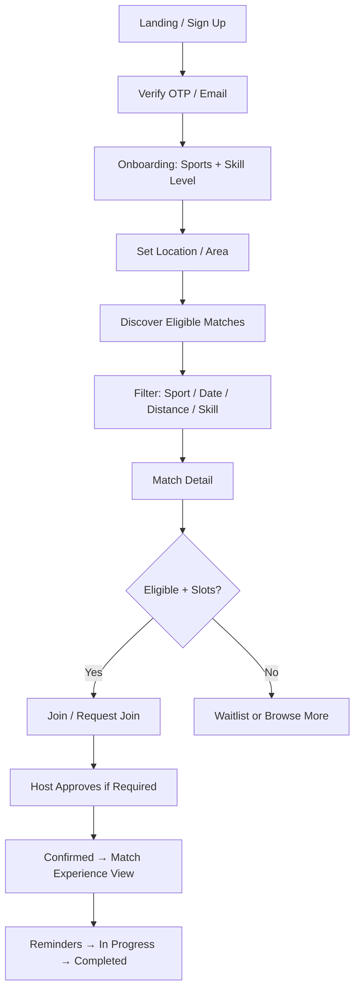
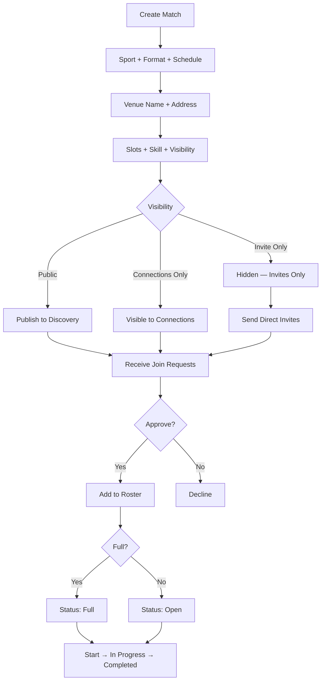
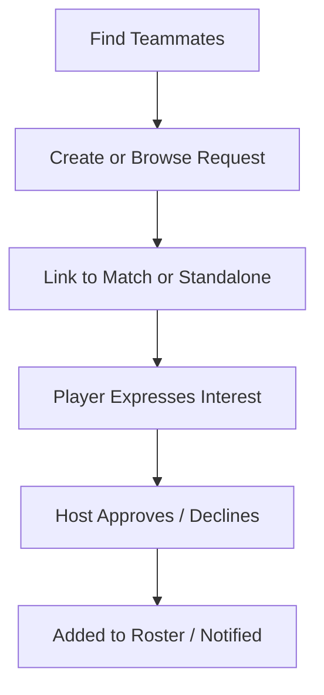
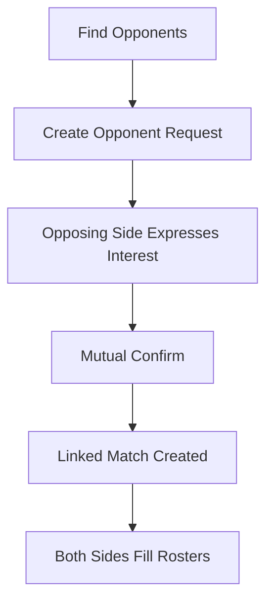
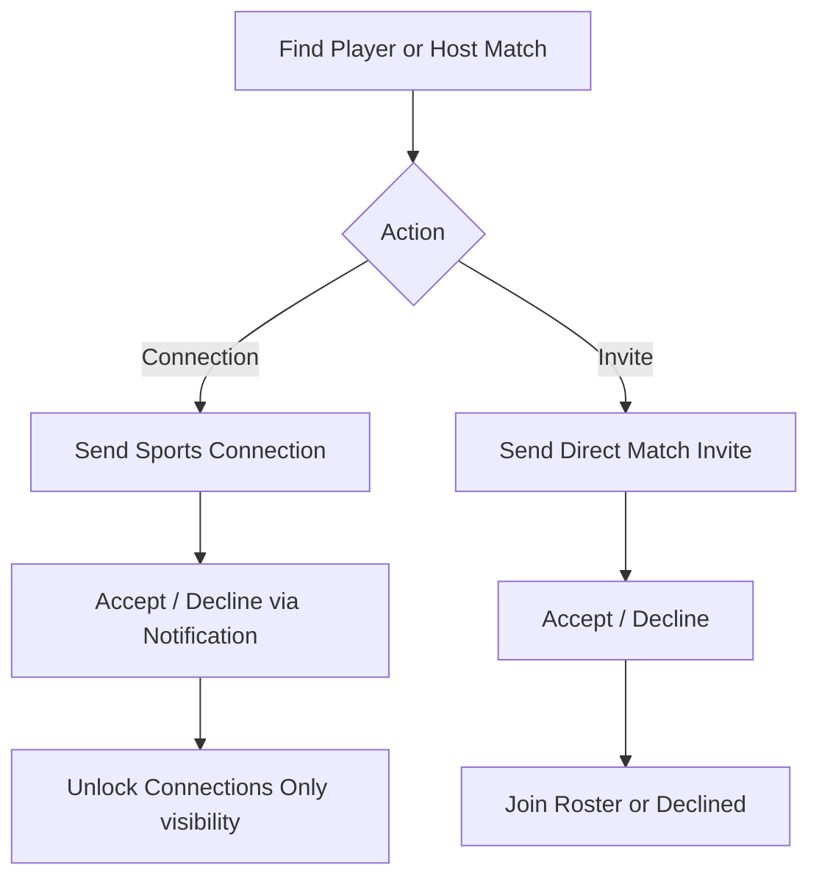
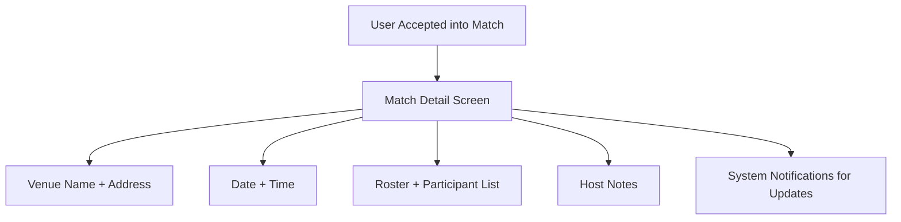
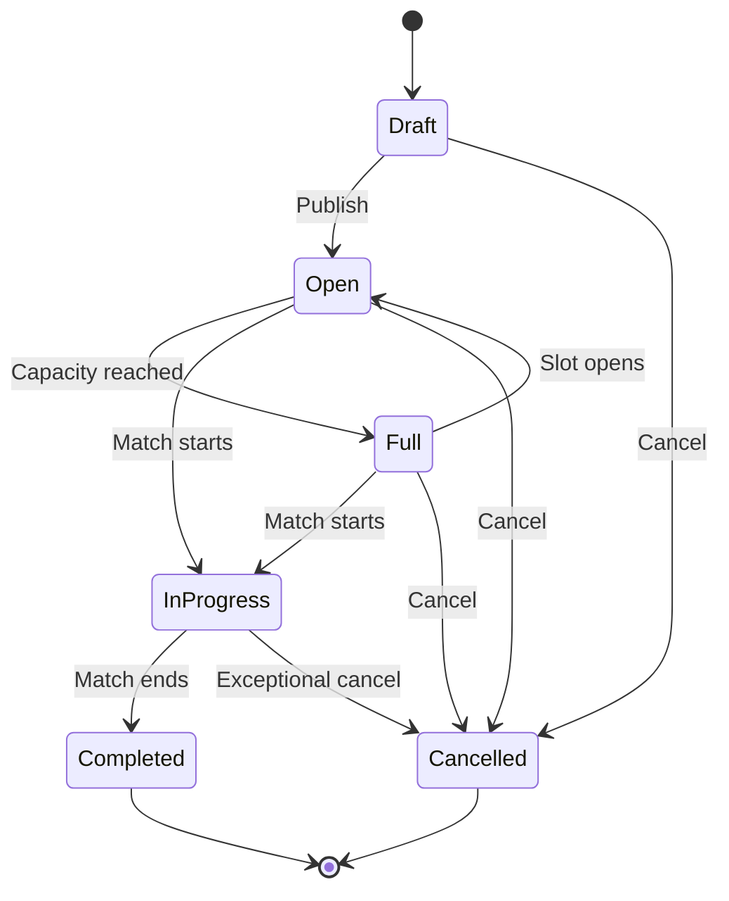

# GamePool — Product Requirements Document (PRD)

**Version:** 2.1  
**Status:** Approved for MVP Development  
**Last Updated:** June 23, 2026  
**Owner:** Product  
**Stakeholders:** Engineering, Design, QA, Growth, Operations

---

## Document Summary

GamePool is a **sports coordination platform** that helps recreational and semi-competitive players find players, teammates, and opponents; create and join matches; and play local games. The MVP focuses on **Football**, **Cricket**, and **Badminton** in a single metro market.

**Core workflow:** Find Players → Find Teammates → Find Opponents → Create Match → Join Match → Play.

GamePool is **not a social media platform**. There are no followers, feeds, posts, personal messaging, contact sharing, or third-party chat integrations. Users coordinate through **structured match workflows** (join requests, match requests, invites, approvals) and **system notifications**.

**Sports Connections** enable faster invites and rediscovery of previous teammates and opponents — they are coordination tools, not social networking.

---

## 1. Vision

**To become the default way people find and play sports in their community — turning empty courts, fields, and weekends into active games.**

GamePool envisions a world where finding a fifth for badminton, a full cricket side, or a Sunday football squad is as easy as opening the app. We connect intent ("I want to play") with availability ("I'm free Saturday morning") across skill levels, locations, and formats.

---

## 2. Mission

**Reduce friction between wanting to play sports and actually playing — by making discovery, coordination, and participation trustworthy, fast, and local.**

We accomplish this by:

- Matching players by sport, skill, location, and availability
- Enabling anyone to host a match with minimal setup
- Building trust through profiles, participation history, and clear expectations
- Prioritizing mobile-first, low-latency experiences for on-the-go coordination

---

## 3. User Personas

### Persona 1: Arjun — The Regular Player

| Attribute | Detail |
|-----------|--------|
| **Age** | 28 |
| **Location** | Urban metro |
| **Sports** | Football (weekly), Badminton (casual) |
| **Behavior** | Plays with the same group but often short 1–2 players; coordinates outside the app today |
| **Goals** | Fill his squad quickly; play at a consistent skill level; avoid no-shows |
| **Pain Points** | Fragmented coordination; unreliable RSVPs; hard to find new players when friends are busy |
| **GamePool Value** | Find teammates/opponents nearby; create matches; send direct invites; open slots to strangers |

### Persona 2: Priya — The Match Seeker

| Attribute | Detail |
|-----------|--------|
| **Age** | 24 |
| **Location** | Suburban area |
| **Sports** | Cricket (beginner/intermediate) |
| **Behavior** | Wants to play more but doesn't have a fixed group; shy about asking strangers |
| **Goals** | Join existing games; learn the sport; meet people with similar schedules |
| **Pain Points** | Doesn't know where games happen; intimidated joining established groups; unclear skill expectations |
| **GamePool Value** | Browse and join open matches; filter by skill level; see host participation history |

### Persona 3: Rahul — The Organizer / Host

| Attribute | Detail |
|-----------|--------|
| **Age** | 35 |
| **Location** | City center |
| **Sports** | All three MVP sports; runs weekend games |
| **Behavior** | Books venues; manages rosters; recruits players for regular matches |
| **Goals** | Fill matches reliably; reduce admin work; grow a local player network |
| **Pain Points** | Manual headcount; last-minute dropouts; payment discussions happen offline |
| **GamePool Value** | Create matches; set visibility (public, connections, invite-only); manage waitlists; send invites; communicate via notifications |

### Persona 4: Sneha — The Competitive Matcher

| Attribute | Detail |
|-----------|--------|
| **Age** | 31 |
| **Location** | Metro |
| **Sports** | Badminton (advanced), Football (intermediate) |
| **Behavior** | Seeks balanced, skill-appropriate games; cares about punctuality and rules |
| **Goals** | Find opponents at her level; avoid mismatched games; build a reliable player network |
| **Pain Points** | Skill labels are vague; wasted trips when games cancel; limited player history |
| **GamePool Value** | Skill-based discovery; opponent matching; participation history (ratings Phase 2) |

---

## 4. User Stories

Stories are grouped by epic. Acceptance criteria are summarized; detailed AC lives in sprint tickets.

### Epic A: Onboarding & Profile

| ID | As a… | I want to… | So that… | Priority |
|----|-------|------------|----------|----------|
| US-A1 | New user | Sign up with phone or email and verify my account | I can securely access GamePool | P0 |
| US-A2 | New user | Select my sports and skill level per sport (Beginner, Intermediate, Advanced) | I get relevant matches and players | P0 |
| US-A3 | User | Set my home location / preferred play areas | Discovery is local and convenient | P0 |
| US-A4 | User | Add availability windows (e.g., weekends, evenings) | Others know when I'm free to play | P1 |
| US-A5 | User | View and edit my profile (photo, bio, sports) | Others can trust and recognize me | P0 |

### Epic B: Find Players

| ID | As a… | I want to… | So that… | Priority |
|----|-------|------------|----------|----------|
| US-B1 | Player | Search/browse players by sport, skill (Beginner/Intermediate/Advanced), and distance | I can find people to play with | P0 |
| US-B2 | Player | Filter players by availability | I only see people who can actually join | P1 |
| US-B3 | Player | View a player's profile and match history | I can decide if they're a good fit | P0 |
| US-B4 | Player | Send a Sports Connection request to another player | I can invite them to future matches and rediscover past teammates/opponents | P0 |

### Epic C: Find Teammates

| ID | As a… | I want to… | So that… | Priority |
|----|-------|------------|----------|----------|
| US-C1 | Match host | Post open teammate slots for my match | I can fill missing positions | P0 |
| US-C2 | Player | Browse open teammate requests near me | I can join someone's existing side | P0 |
| US-C3 | Player | Apply or request to join as a teammate | The host can approve me | P0 |
| US-C4 | Host | Approve or decline teammate requests | I control who joins my squad | P0 |

> **MVP note:** Teammate flows are **individual-centric** — the host acts as squad coordinator. Team entities, Team profiles, and Team management UI are **Phase 2**. Database, API, and match architecture must remain **team-ready** (see §5, §13).

### Epic D: Find Opponents

| ID | As a… | I want to… | So that… | Priority |
|----|-------|------------|----------|----------|
| US-D1 | Player (side captain) | Post that my side needs an opponent | We can schedule a competitive game | P0 |
| US-D2 | Player | Browse sides looking for opponents | I can challenge a suitable opponent | P0 |
| US-D3 | Captain | Match by sport, format, skill, and date | Games are fair and scheduled | P0 |
| US-D4 | Captain | Confirm opponent pairing | Both sides commit to the match | P0 |

> **MVP note:** "Captain" and "side" refer to an **individual user coordinating one match side**, not a persistent Team profile. Opponent matching APIs and schema must support future `team_id` linkage without rework.

### Epic E: Create & Join Matches

| ID | As a… | I want to… | So that… | Priority |
|----|-------|------------|----------|----------|
| US-E1 | Host | Create a match (sport, format, date, venue, slots) | Others can discover and join per visibility rules | P0 |
| US-E2 | Player | Browse upcoming matches by sport, location, and visibility eligibility | I find games I am allowed to join | P0 |
| US-E3 | Player | Submit a match join request (or join directly if auto-join enabled) | I can secure my spot | P0 |
| US-E4 | Host | Set match visibility to Public, Connections Only, or Invite Only | I control who can discover and join my match | P0 |
| US-E5 | Player | Leave a match before a cutoff time | I'm not locked in if plans change | P0 |
| US-E6 | Participant | Receive reminders and match updates | I don't miss the game | P1 |
| US-E7 | Host | Send a direct match invite to a specific player | I can fill invite-only or connections-only games | P0 |
| US-E8 | Player | Accept or decline a direct match invite | I can respond without browsing the full catalog | P0 |
| US-E9 | Player | Join a waitlist when a match is full | I can play if a slot opens | P1 |
| US-E10 | Confirmed participant | View full match details after acceptance | I know when, where, who is playing, and host notes | P0 |
| US-E11 | Host | Mark match as In Progress when play begins and Completed when finished | Match lifecycle reflects actual game state | P1 |

### Epic G: Notifications & Trust

| ID | As a… | I want to… | So that… | Priority |
|----|-------|------------|----------|----------|
| US-G1 | User | Get notified of match requests, approvals, cancellations, connections, and invites | I can respond in time | P0 |
| US-G2 | User | Report no-shows or inappropriate behavior | The community stays safe | P1 |
| US-G3 | User | Block another user | I avoid unwanted contact | P1 |

### Epic H: Admin Platform (MVP)

| ID | As a… | I want to… | So that… | Priority |
|----|-------|------------|----------|----------|
| US-H1 | Admin | Log in to a secure admin platform | I can manage the product safely | P0 |
| US-H2 | Admin | View a dashboard with growth, engagement, and moderation metrics | I can monitor platform health in real time | P0 |
| US-H3 | Admin | Search, view, and suspend users | I can enforce community standards | P0 |
| US-H4 | Admin | View, edit status, and remove matches from discovery | I can resolve abuse or errors | P0 |
| US-H5 | Admin | Review reports and take moderation action | Reported issues are handled promptly | P0 |

> **US-H2 dashboard metrics (MVP):** New Users Today, Active Matches, Pending Reports, Weekly Active Players (WAP), Match Fill Rate, Sports Distribution, Top Active Locations.

---

## 5. MVP Scope

### MVP Philosophy

Optimize the MVP for **fast launch**, **low complexity**, **high user adoption**, and **clear product-market validation**.

**Core workflow (non-negotiable):**

```
Find Players → Find Teammates → Find Opponents → Create Match → Join Match → Play
```

Avoid features that significantly increase development effort without directly improving this workflow. Prefer structured coordination (match requests, invites, approvals, notifications) over open-ended social or messaging features.

**Communication model (MVP):**

- No personal messaging
- No WhatsApp or third-party chat integration
- No contact, phone number, or email sharing between users
- No social feed, followers, or following
- Coordination via match requests, invites, Sports Connections, and system notifications only

### In Scope (MVP)

| Area | MVP Deliverable |
|------|-----------------|
| **Sports** | Football, Cricket, Badminton |
| **Platforms** | Mobile-first responsive web (native apps per monorepo roadmap) |
| **Auth** | Phone OTP + email; basic profile |
| **Skill levels** | Beginner, Intermediate, Advanced (per sport) |
| **Find Players** | Search/browse by sport, skill, distance |
| **Find Teammates** | Teammate requests linked to matches or standalone |
| **Find Opponents** | Opponent requests; bilateral confirm (individual-centric) |
| **Matches** | Create, publish, join, leave, cancel; host roster management |
| **Match visibility** | Public, Connections Only, Invite Only |
| **Match lifecycle** | Draft → Open → Full → In Progress → Completed; Cancelled terminal |
| **Match requests** | Join requests with host approve/decline (or auto-join per policy) |
| **Direct match invites** | Host-to-player invites; accept/decline |
| **Waitlists** | Join waitlist when full; promotion on slot open |
| **Sports Connections** | Send/accept/decline; faster invites; rediscover past players |
| **Match experience** | Post-acceptance: details, venue, date/time, roster, host notes — no chat |
| **Venue (MVP)** | `venue_name`, `venue_address` on match; venue-ready schema for future |
| **Notifications** | In-app + push/email for coordination events |
| **Moderation** | Report user/match; block user |
| **Admin platform** | Login, dashboard (7 metrics), user/match management, reports & moderation |
| **Location** | City/area + venue text; optional map pin |
| **Geography** | Single launch city (TBD); extensible region model |
| **Architecture** | Team-ready and venue-ready DB/API; expansion-ready for Activities, Payments, Tournaments (UI deferred) |

### Out of Scope (MVP)

| Item | Target Phase |
|------|--------------|
| Sports Activities (UI, flows, screens) | Phase 2 |
| Match chat rooms | Phase 2 |
| Team management UI, Team profiles, Team members | Phase 2 |
| Player ratings and reliability scores | Phase 2 |
| Payments, wallet, subscriptions, coupons | Phase 3 |
| Venue/turf marketplace and booking | Phase 3 |
| Tournaments and leagues | Phase 3–4 |
| Advertisements and featured listings (consumer) | Phase 3 |
| Personal messaging, contact sharing, social feeds | Never (coordination platform) |
| AI match recommendations | Phase 5 |
| Skill verification / certification | Post-MVP |
| Public API for third parties | Phase 4 |

### MVP Assumptions

1. Users share approximate location (area-level) for discovery.
2. Hosts manually enter `venue_name` and `venue_address`; no integrated venue booking in MVP.
3. Trust is built through profiles and match participation counts.
4. Launch city has sufficient player density in at least one sport (Football recommended).
5. Users coordinate only through in-app structured workflows and notifications.
6. Database and backend implement **team-ready** and **venue-ready** patterns without Team or Venue UI in MVP.

### MVP Definition of Done

A user can sign up, complete profile (skill: Beginner/Intermediate/Advanced), find players/teammates/opponents, create or join a match with correct visibility rules, send/receive connections and direct invites, view confirmed match details (no chat), and receive notifications through match day — with **< 5% failed join actions** in QA.

---

## 6. Future Scope

### Phase 2 — Engagement & Coordination Depth

**Sports Activities (deferred from MVP)**

| ID | User Story | Priority (Phase 2) |
|----|------------|-------------------|
| US-F1 | Organizer creates recurring or one-off activity | P0 |
| US-F2 | Player browses activities by sport, day, location | P0 |
| US-F3 | Player joins activity instance and sees attendee list | P0 |
| US-F4 | Organizer caps participants and manages waitlist | P1 |

- **Match chat rooms** — match-scoped group chat for confirmed participants only (not personal DM)
- **Team management** — Team entities, Team profiles, Team members, Team-hosted matches
- **Player ratings and reliability scores** (show-up rate)
- Team-based opponent challenges
- Saved searches and match alerts

### Phase 3 — Monetization & Partnerships

- **Venue marketplace** — turf discovery, booking, verification (builds on §13.4 venue-ready architecture)
- Paid premium matches or hosted events
- **Advertisement management** and sponsored placements
- **Subscription plans** for hosts and venues
- **Coupon management**
- **Featured listings** for matches and venues
- Organizer analytics export

### Phase 4 — Scale & Depth

- Additional sports
- **Tournament management** (brackets, fixtures, registration)
- Multi-city expansion
- Native mobile apps with offline match details
- Public API for clubs and academies
- Club profiles and academy profiles (B2B coordination — not social feeds)

### Phase 5 — Intelligence

- Smart match recommendations
- Achievement badges and participation streaks
- Wearable integrations (optional)

### Admin Platform — Future Modules (Phase 2+)

| Module | Description |
|--------|-------------|
| Venue management | Turf/venue catalog, verification, slots |
| Tournament management | Create and operate tournaments |
| Advertisement management | Campaigns, placements, reporting |
| Subscription management | Plans, billing, entitlements |
| Coupon management | Promo codes and redemption |
| Featured listings | Boost visibility for matches/venues |
| Analytics dashboard | Advanced funnels, retention, marketplace health |
| Sports category management | Admin control of sports catalog |
| Notification campaigns | Broadcast and targeted pushes |
| Payment management | Transactions, refunds, disputes |

> **Permanent non-goals:** Followers, following, social feeds, posts, reactions, community timelines, personal messaging, contact sharing.

---

## 7. Functional Requirements

### 7.1 Authentication & Account

| ID | Requirement |
|----|-------------|
| FR-1 | System shall allow registration via phone (OTP) or email (magic link or password). |
| FR-2 | System shall require unique phone OR email per account. |
| FR-3 | Users shall be able to log out and request account deletion (GDPR export deferred post-MVP). |
| FR-4 | Session shall expire after configurable inactivity (default 30 days). |

### 7.2 User Profile

| ID | Requirement |
|----|-------------|
| FR-5 | Profile shall include: display name, photo (optional), bio (optional), home area, sports list with skill per sport. |
| FR-6 | Skill levels per sport: **Beginner**, **Intermediate**, **Advanced** only. |
| FR-7 | Profile shall display: matches joined, matches hosted, member since date. |
| FR-8 | Users shall set profile visibility to **Public** or **Connections-only** (default Public). Connections-only restricts full profile to accepted Sports Connections. |

### 7.3 Player Discovery (Find Players)

| ID | Requirement |
|----|-------------|
| FR-9 | Users shall search players by sport, skill level (Beginner/Intermediate/Advanced), distance radius, and availability (if set). |
| FR-10 | Search results shall show: name, photo, sports/skills, approximate distance. Reliability scores display in Phase 2. |
| FR-11 | Users shall view full public profile from search results (respecting profile visibility). |
| FR-12 | Users may send a **Sports Connection** request; recipient may accept or decline via notification. Connections enable future invites and player rediscovery — not social networking, messaging, or contact sharing. |

### 7.4 Teammate & Opponent Discovery

| ID | Requirement |
|----|-------------|
| FR-13 | Users shall create a Teammate Request linked to a match or standalone. |
| FR-14 | Users shall create an Opponent Request specifying sport, format, date/time window, venue area, skill band (Beginner/Intermediate/Advanced). |
| FR-15 | System shall list open teammate and opponent requests with filters. |
| FR-16 | Interested users shall express interest; creator approves or declines. |
| FR-17 | On opponent pairing approval, system shall link two sides to a shared match. MVP sides are individual-led; schema shall support future `team_id` without migrating core match data. |

### 7.5 Match Management

| ID | Requirement |
|----|-------------|
| FR-18 | Host shall create match with: sport, title, format, date/time, duration, `venue_name`, `venue_address`, slots, skill expectation (Beginner/Intermediate/Advanced), visibility, host notes. |
| FR-19 | Match lifecycle states: `Draft`, `Open`, `Full`, `In Progress`, `Completed`, `Cancelled`. See §7.5.1. |
| FR-20 | Match visibility shall support: **Public**, **Connections Only**, **Invite Only**. See §7.5.2. |
| FR-21 | Players shall submit match join requests or join directly per host policy; host may approve or decline. Visibility rules apply before join is permitted. |
| FR-22 | Host shall remove participants with optional reason. |
| FR-23 | Players shall leave match before configurable cutoff (default 2 hours); after cutoff, leave requires host approval. Not permitted when match is `In Progress` or `Completed`. |
| FR-24 | Host shall cancel match (sets `Cancelled`); all participants notified immediately. |
| FR-25 | When match is full, players may join waitlist if enabled; system promotes waitlist on slot open. |
| FR-26 | **Confirmed participants** shall see match detail: `venue_name`, `venue_address`, date/time, roster, participant list, host public profile, host notes. No chat in MVP. |
| FR-27 | System shall not expose user phone numbers, email addresses, or private contact information. |
| FR-28 | Host may transition match to `In Progress` at scheduled start (manual or automatic per policy) and to `Completed` after play ends. |

#### 7.5.1 Match Lifecycle

| State | Description | Transitions |
|-------|-------------|-------------|
| **Draft** | Created, not published | → `Open` (publish), → `Cancelled` |
| **Open** | Accepting join requests / joins | → `Full` (capacity reached), → `In Progress` (at start), → `Cancelled` |
| **Full** | Capacity reached; waitlist may be active | → `Open` (slot opens), → `In Progress` (at start), → `Cancelled` |
| **In Progress** | Match is underway; roster locked | → `Completed`, → `Cancelled` (exceptional) |
| **Completed** | Match finished; terminal (read-only) | — |
| **Cancelled** | Host or admin cancelled; terminal | — |

**Rules:**

- Join and leave not permitted in `In Progress` or `Completed` (except admin override).
- `Invite Only` matches hidden from public/connections discovery regardless of state (except to invitees and participants).
- Reminders sent for `Open`, `Full`, and confirmed participants before `In Progress`.

#### 7.5.2 Match Visibility

| Visibility | Discovery | Who Can Join |
|------------|-----------|--------------|
| **Public** | Visible to all eligible users in discovery feeds and search | Any eligible user (subject to skill, blocks, capacity) |
| **Connections Only** | Visible only to host's accepted Sports Connections | Connections only (+ direct invitees); others cannot see match |
| **Invite Only** | Hidden from all discovery feeds | Only users with direct invite or explicit host approval |

**Rules:**

- Default visibility: **Public**.
- `Connections Only` requires accepted Sports Connection with host (or co-host, future).
- `Invite Only` requires direct invite to view match; share via invite link optional.
- Host may change visibility only while match is `Draft` or `Open` (not after `Full` / `In Progress`).

#### 7.5.3 Venue Fields (MVP)

| Field | MVP | Future |
|-------|-----|--------|
| `venue_name` | Required text | May link to venue catalog |
| `venue_address` | Optional text | May link to venue catalog |
| `venue_id` | — | Nullable FK to `venues` table |
| `venue_source` | — | Enum: `MANUAL`, `MARKETPLACE`, `PARTNER` |

### 7.6 Match Invites & Sports Connections

| ID | Requirement |
|----|-------------|
| FR-29 | Host shall send **direct match invites** to specific users; invitees accept or decline. Required for `Invite Only`; optional for other visibilities. |
| FR-30 | Accepted Sports Connections enable: faster direct invites, discovering previous teammates/opponents, viewing `Connections Only` matches, and Connections-only profile visibility. No messaging or contact exchange. |

### 7.7 Notifications

| ID | Requirement |
|----|-------------|
| FR-31 | Notify on: match join request, approval/decline, match full, waitlist promotion, cancellation, match starting (`In Progress`), reminders (24h and 2h), teammate/opponent interest, Sports Connection request, direct match invite. |
| FR-32 | Users shall configure notification channels (push, email); MVP may use global on/off. |

### 7.8 Safety & Moderation

| ID | Requirement |
|----|-------------|
| FR-33 | Users shall report profiles or matches with reason codes. |
| FR-34 | Users shall block others; blocked users cannot see host's `Connections Only` matches, join matches, send connection requests, or send invites. |
| FR-35 | Admin shall review reports and suspend accounts via Admin Platform. |

### 7.9 Admin Platform (MVP)

| ID | Requirement |
|----|-------------|
| FR-36 | Admin shall authenticate via secure, role-based login separate from consumer auth. |
| FR-37 | Dashboard shall display the following metrics (MVP), refreshable on load and at configurable interval: **New Users Today**, **Active Matches** (Open + Full + In Progress), **Pending Reports**, **Weekly Active Players (WAP)**, **Match Fill Rate** (7-day rolling), **Sports Distribution** (matches by sport), **Top Active Locations** (by area/city). |
| FR-38 | Admin shall search, view, suspend, and reinstate users. |
| FR-39 | Admin shall search, view, cancel, transition match status, and hide matches from discovery. |
| FR-40 | Admin shall manage reports queue: review, resolve, dismiss, with audit trail. |

> **Future admin modules:** Venue management, tournament management, advertisement management, subscription management, coupon management, featured listings, advanced analytics — see §6.

### 7.10 Sport-Specific Rules (MVP)

| Sport | Format Options | Default Slot Logic |
|-------|----------------|-------------------|
| **Football** | 5-a-side, 7-a-side, 11-a-side | Total players = 2 × team size (or host-defined) |
| **Cricket** | T10, T20, practice nets | 11–22 players or host-defined; nets = open count |
| **Badminton** | Singles, Doubles, Mixed | 2 or 4 players per court; host may add multiple courts |

### 7.11 Communication & Match Experience (MVP)

| ID | Requirement |
|----|-------------|
| FR-41 | Permitted coordination: match join requests, teammate/opponent requests, Sports Connection requests, direct match invites, participation state changes, system notifications. |
| FR-42 | Prohibited in MVP: personal messaging, match chat, contact/phone/email sharing, WhatsApp or third-party chat, social feeds, followers/following. |
| FR-43 | After acceptance into a match, user sees structured match experience only (§7.5 FR-26). Match chat rooms are Phase 2. |

### 7.12 Sports Activities (Phase 2 — Reference Only)

> Not in MVP. Retained for expansion planning.

| ID | Requirement | Phase |
|----|-------------|-------|
| FR-44 | Organizer creates Activity: sport, title, schedule, location, max participants, skill level. | 2 |
| FR-45 | Activities may be one-off or recurring series. | 2 |
| FR-46 | Users join individual activity instance; roster visible to participants. | 2 |
| FR-47 | Organizer may close registration N hours before start. | 2 |

---

## 8. Non-Functional Requirements

### 8.1 Performance

| ID | Requirement | Target |
|----|-------------|--------|
| NFR-1 | Page load (discovery feed) | < 2s on 4G |
| NFR-2 | Search results | < 1s for 95th percentile |
| NFR-3 | Join match / match request action | < 500ms perceived; atomic slot reservation |
| NFR-4 | Concurrent joins on last slot | No double-booking; one winner; others get waitlist or clear error |

### 8.2 Availability & Reliability

| ID | Requirement | Target |
|----|-------------|--------|
| NFR-5 | Uptime | 99.5% monthly (MVP) |
| NFR-6 | Data backup | Daily backups; RPO 24h, RTO 4h |
| NFR-7 | Notification delivery | 99% within 60s for push |

### 8.3 Security & Privacy

| ID | Requirement |
|----|-------------|
| NFR-8 | All traffic over HTTPS/TLS 1.2+. |
| NFR-9 | Passwords (if used) hashed with bcrypt/argon2; OTP rate-limited. |
| NFR-10 | PII encrypted at rest; least-privilege admin access. |
| NFR-11 | Exact home address never shown publicly — area/neighborhood + distance only. |
| NFR-12 | Phone and email never exposed between users in MVP. |
| NFR-13 | Compliance-ready privacy policy and terms; age gate 13+ (or local minimum). |
| NFR-14 | `Connections Only` and `Invite Only` matches enforced server-side; never exposed via public API to ineligible users. |

### 8.4 Scalability

| ID | Requirement |
|----|-------------|
| NFR-15 | Support 50k registered users and 5k DAU in launch city without architecture rewrite. |
| NFR-16 | Horizontal scaling for read-heavy discovery endpoints. |
| NFR-17 | Data model supports future Teams, Activities, Venues, Payments, Tournaments, Ads, and Subscriptions without breaking `users`, `matches`, `match_participants`. |
| NFR-18 | Admin platform uses RBAC and immutable audit logging for moderation actions. |

### 8.5 Usability & Accessibility

| ID | Requirement |
|----|-------------|
| NFR-19 | Mobile-first UI; core flows ≤ 3 taps from home. |
| NFR-20 | WCAG 2.1 AA for primary flows. |
| NFR-21 | Support latest two versions of Chrome, Safari, Firefox, Edge. |

### 8.6 Observability

| ID | Requirement |
|----|-------------|
| NFR-22 | Structured logging for auth, join, visibility checks, and payment-adjacent events. |
| NFR-23 | Error tracking (e.g., Sentry) with session correlation. |
| NFR-24 | Analytics: signup → profile complete → first join/host funnel. |

---

## 9. Success Metrics

### North Star Metric

**Weekly Active Players (WAP):** Unique users who join or host at least one **match** per week.

### Primary KPIs (First 90 Days)

| Metric | Definition | MVP Target |
|--------|------------|------------|
| **Activation rate** | % signups completing profile + 1 sport + location within 24h | ≥ 60% |
| **First action rate** | % activated users who join OR create a match within 7 days | ≥ 40% |
| **Match fill rate** | % open matches reaching ≥ 80% capacity before start | ≥ 55% |
| **Show-up rate** | % joined users attending (host confirm or honor system) | ≥ 70% |
| **Host repeat rate** | % hosts creating ≥ 2 matches in 30 days | ≥ 25% |
| **D7 retention** | % new users active on day 7 | ≥ 30% |
| **D30 retention** | % new users active on day 30 | ≥ 15% |

### Secondary KPIs

| Metric | Definition | Notes |
|--------|------------|-------|
| Time to fill | Median hours from publish to full | Lower is better |
| Search-to-join conversion | Joins / discovery sessions | Filter optimization |
| Match request approval rate | Approved / total requests | Host responsiveness |
| Connection accept rate | Accepted / sent Sports Connections | Network quality |
| Invite accept rate | Accepted / direct match invites | Private game fill |
| Waitlist conversion | Promoted waitlist joins / waitlist size | Capacity utilization |
| Visibility mix | % matches by Public / Connections / Invite Only | Host behavior signal |
| Report rate | Reports / MAU | Target < 2% |
| Cancellation rate | Host cancellations / scheduled matches | Target < 10% |

### Counter-Metrics (Guardrails)

- Spam matches per host
- Block/report rate per active user
- OTP abuse / fake account rate

---

## 10. User Flows

### Flow 1: New User → First Join



### Flow 2: Host Creates Match → Fills Roster



### Flow 3: Find Teammate



### Flow 4: Find Opponent



### Flow 5: Sports Connection & Direct Invite



### Flow 6: Confirmed Match Experience (No Chat)



### Flow 7: Match Lifecycle (Host)



---

## 11. Screen List

### Authentication & Onboarding

| # | Screen | Purpose |
|---|--------|---------|
| S01 | Splash / Welcome | Brand, value prop, sign up / log in |
| S02 | Sign Up | Phone/email entry |
| S03 | OTP / Verification | Account verification |
| S04 | Log In | Returning users |
| S05 | Onboarding — Sports | Football, Cricket, Badminton |
| S06 | Onboarding — Skill | Beginner / Intermediate / Advanced per sport |
| S07 | Onboarding — Location | City/area picker |
| S08 | Onboarding — Availability (optional) | Weekly windows |

### Main Navigation

| # | Screen | Purpose |
|---|--------|---------|
| S09 | Home / Discover | Public + eligible Connections Only matches |
| S10 | Find Players | Player search; skill filter (B/I/A) |
| S11 | Find Teammates | Teammate requests |
| S12 | Find Opponents | Opponent requests |
| S14 | My Games | Hosted and joined; lifecycle states |
| S15 | Profile (self) | View/edit profile and sports/skills |
| S16 | Notifications | In-app inbox |
| S17 | Settings | Account, notifications, privacy |

### Player & Coordination

| # | Screen | Purpose |
|---|--------|---------|
| S18 | Player Profile (other) | Public profile view |
| S19 | Sports Connection | Send or respond to connection request |
| S20 | Block / Report | Safety actions |
| S30 | Connections Inbox | Pending sent/received connections |

### Match Flows

| # | Screen | Purpose |
|---|--------|---------|
| S21 | Create Match — Step 1 | Sport & format |
| S22 | Create Match — Step 2 | Schedule, venue name & address |
| S23 | Create Match — Step 3 | Slots, skill, visibility (Public/Connections/Invite), notes |
| S24 | Match Detail | Venue, time, roster, notes, lifecycle badge (no chat) |
| S25 | Match Manage (host) | Requests, invites, status transitions, cancel |
| S26 | Join / Request Confirmation | Success + calendar |
| S27 | Teammate Request Detail | Express interest |
| S28 | Opponent Request Detail | Express interest |
| S29 | Direct Match Invite | Send, accept, decline |
| S35 | Waitlist Confirmation | Waitlist joined |

### Utility & Error States

| # | Screen | Purpose |
|---|--------|---------|
| S33 | Empty States | No matches, no results |
| S34 | Error / Offline | Retry; cached My Games |

### Admin Platform (MVP)

| # | Screen | Purpose |
|---|--------|---------|
| S36 | Admin Login | Staff authentication |
| S37 | Admin Dashboard | New Users Today, Active Matches, Pending Reports, WAP, Match Fill Rate, Sports Distribution, Top Active Locations |
| S38 | User Management | Search, suspend, reinstate |
| S39 | Match Management | Search, status change, cancel, hide |
| S40 | Reports & Moderation | Queue, resolve, audit |

**Total MVP screens:** 36

---

## 12. Edge Cases

### Account & Profile

| # | Edge Case | Expected Behavior |
|---|-----------|-------------------|
| EC-1 | User skips onboarding | Prompt before join/host; browse read-only OK |
| EC-2 | Duplicate phone/email | Block; offer recovery |
| EC-3 | No sports selected | Require ≥1 sport to complete onboarding |
| EC-4 | Skill changed after joining match | Applies to future joins only |
| EC-5 | Deleted/suspended user | Hidden from search; cancel future hosted matches |

### Discovery & Search

| # | Edge Case | Expected Behavior |
|---|-----------|-------------------|
| EC-6 | No players in radius | Suggest wider radius; CTA to create match |
| EC-7 | Stale location | Prompt periodic update |
| EC-8 | User blocks host | Hide all host matches including Connections Only; block requests and invites |
| EC-9 | Non-connection views Connections Only match | 404 or not found; no leak of match metadata |

### Match Visibility

| # | Edge Case | Expected Behavior |
|---|-----------|-------------------|
| EC-10 | User loses connection after seeing match | Retain access if already joined; discovery hidden on refresh |
| EC-11 | Host changes visibility after joins | Disallow after first participant joins |
| EC-12 | Invite Only without invite | Block join; show invite-required message |
| EC-13 | Public match in discovery for blocked user | Hidden per block rules |

### Match Join, Requests & Waitlist

| # | Edge Case | Expected Behavior |
|---|-----------|-------------------|
| EC-14 | Two users join last slot | Transaction lock; one wins; other waitlist or error |
| EC-15 | Duplicate join | Idempotent; show already joined |
| EC-16 | Host reduces slots below roster | Disallow until members removed |
| EC-17 | Leave after cutoff | Warning; host approval or disallow |
| EC-18 | Leave during In Progress | Disallow |
| EC-19 | Incomplete roster at start | Host may start In Progress or cancel |
| EC-20 | Host no-show | Participants report; reliability Phase 2 |
| EC-21 | Waitlist slot opens | Notify next; time-limited accept |

### Match Lifecycle

| # | Edge Case | Expected Behavior |
|---|-----------|-------------------|
| EC-22 | Host forgets to mark Completed | Auto-complete N hours after scheduled end (configurable) |
| EC-23 | Cancel during In Progress | Allowed with reason; notify all participants |
| EC-24 | Join attempt on Completed/Cancelled | Reject with clear state message |
| EC-25 | Full match gets slot from leave | Transition Open; process waitlist |

### Teammate / Opponent Matching

| # | Edge Case | Expected Behavior |
|---|-----------|-------------------|
| EC-26 | Multiple opponent interests | Creator picks one; others declined |
| EC-27 | Opponent request expires | Auto-archive; notify creator |
| EC-28 | Teammate request on cancelled match | Auto-close; notify applicants |

### Sports Connections & Direct Invites

| # | Edge Case | Expected Behavior |
|---|-----------|-------------------|
| EC-29 | Connection to blocked user | Error; no notification to blocked |
| EC-30 | Invite to full match | Waitlist offer if enabled |
| EC-31 | Connection/invite spam | Rate limit; admin flag |

### Notifications & Time

| # | Edge Case | Expected Behavior |
|---|-----------|-------------------|
| EC-32 | Timezone differences | Store UTC; display local |
| EC-33 | DST on match time | Timezone-aware display |
| EC-34 | Push disabled | Email fallback for critical events |

### Safety & Abuse

| # | Edge Case | Expected Behavior |
|---|-----------|-------------------|
| EC-35 | Spam match creation | Rate limit hosts |
| EC-36 | Fake profiles | OTP; report flow |
| EC-37 | Minors | Age gate; policy per jurisdiction |

### Sport-Specific

| # | Edge Case | Expected Behavior |
|---|-----------|-------------------|
| EC-38 | Cricket short of 22 players | Host decides proceed or cancel |
| EC-39 | Badminton format mismatch | Format locked at create |
| EC-40 | Football format mismatch | Prominent format in discovery |

### System & Offline

| # | Edge Case | Expected Behavior |
|---|-----------|-------------------|
| EC-41 | Network loss during join | Idempotent retry |
| EC-42 | Server error on match day | Cached My Games; offline banner |
| EC-43 | Admin suspends match | Set Cancelled or hidden; notify participants |

---

## 13. Scalability & Expansion Readiness

Architecture (database, API, monorepo) must support future modules **without major redesign** of core entities: `users`, `matches`, `match_participants`, `notifications`.

### 13.1 Team-Ready Architecture (MVP — no Team UI)

MVP is individual-centric. Engineering shall:

- Reserve nullable `team_id` on `matches`, `match_participants`, teammate/opponent requests
- Model opponent **sides** bindable to future `teams` without rewriting history
- Avoid single-user-only assumptions in host/captain APIs
- Support opponent matching flows that map to Team tournament participation later

**Phase 2 Team UI:** Team entities, Team members, Team profiles, Team management.

### 13.2 Expansion Modules

| Module | MVP readiness | Phase |
|--------|---------------|-------|
| **Teams** | Nullable FKs, side model, role enum | UI: Phase 2 |
| **Sports Activities** | Participant pattern mirrors matches | Phase 2 |
| **Match chat rooms** | Match entity as conversation scope | Phase 2 |
| **Tournaments** | `match_type`, `tournament_id` on matches | Phase 3–4 |
| **Turf / Venue management** | §13.4 venue-ready fields | Phase 3 |
| **Payments** | Ledger, webhooks, idempotency; audit from day one | Phase 3 |
| **Wallet** | Separate financial domain | Phase 3 |
| **Subscriptions** | Decoupled from user core | Phase 3 |
| **Advertisements** | `ad_campaigns`; never block join path | Phase 3 |
| **Featured listings** | Billing hook + discovery rank | Phase 3 |
| **Coupons** | Redemption service | Phase 3 |
| **Club / Academy profiles** | `organizations` pattern; B2B not social | Phase 4 |
| **Smart recommendations** | Event pipeline + optional ML | Phase 5 |
| **Multi-city** | `cities` reference table; geo indexes | Before city #2 |
| **Admin platform** | Scalable modules per §6 | Phase 2+ modules |

### 13.3 Venue-Ready Architecture (MVP — no Venue UI)

MVP stores venue as free text on the match. Engineering shall implement **venue-ready** patterns so Turf Management, Venue Marketplace, Venue Booking, and Venue Verification can be added without redesigning `matches`.

#### MVP fields (required on `matches`)

| Field | Type | Required | Description |
|-------|------|----------|-------------|
| `venue_name` | `VARCHAR` | Yes | Display name (e.g., "Andheri Sports Turf") |
| `venue_address` | `VARCHAR` | No | Full address text for participant directions |

#### Future-ready fields (add in MVP schema, nullable)

| Field | Type | Description |
|-------|------|-------------|
| `venue_id` | `UUID` FK → `venues.id` | NULL in MVP; populated when venue catalog exists |
| `venue_source` | `ENUM` | `MANUAL` (MVP default), `MARKETPLACE`, `PARTNER`, `VERIFIED` (future) |

#### Future `venues` table (Phase 3 — design now, implement later)

| Column | Purpose |
|--------|---------|
| `id`, `name`, `slug` | Identity |
| `address`, `city`, `area`, `latitude`, `longitude` | Location |
| `owner_organization_id` | Venue operator (B2B) |
| `verification_status` | `PENDING`, `VERIFIED`, `SUSPENDED` |
| `sports_supported` | JSON/array FK to sports |
| `amenities`, `photos` | Discovery metadata |
| `is_active` | Admin toggle |

#### Future capabilities enabled

| Capability | Depends on |
|------------|------------|
| **Turf management** | `venues` + `venue_slots` + owner org |
| **Venue marketplace** | `venues` + search index + `venue_source = MARKETPLACE` |
| **Venue booking** | `venue_slots`, `bookings`, payment ledger |
| **Venue verification** | `verification_status` workflow + admin module |

#### Engineering requirements (MVP)

| ID | Requirement |
|----|-------------|
| VR-1 | All matches shall store `venue_name`; `venue_address` optional. |
| VR-2 | Schema shall include nullable `venue_id` and `venue_source` defaulting to `MANUAL`. |
| VR-3 | API shall accept and return venue text fields; ignore `venue_id` if null. |
| VR-4 | Match discovery and detail views shall display `venue_name` and `venue_address` for participants. |
| VR-5 | Migration from text-only to catalog venue shall be non-destructive: set `venue_id`, retain text as snapshot or sync from catalog. |

### 13.4 Permanent Non-Goals

- Followers, following, social feeds, posts, reactions, timelines
- Personal messaging (except Phase 2+ match-scoped chat rooms)
- Phone, email, or contact sharing between users
- WhatsApp or third-party chat integrations

---

## Appendix A: Glossary

| Term | Definition |
|------|------------|
| **Match** | Scheduled game with fixed time, venue, and roster slots |
| **Match request** | Player request to join a match; host may approve |
| **Direct invite** | Host-invited player to a specific match |
| **Sports Connection** | Accepted coordination link between two players — not social follow |
| **Match visibility** | Public, Connections Only, or Invite Only — controls discovery and join eligibility |
| **Host** | User who creates and manages a match |
| **Side captain** | Individual coordinating one opponent side (MVP); Team captain in Phase 2 |
| **Roster** | Confirmed participants for a match |
| **Waitlist** | Queue when match is full |
| **WAP** | Weekly Active Players — join or host ≥1 match per week |
| **Match lifecycle** | Draft → Open → Full → In Progress → Completed; Cancelled terminal |
| **venue_source** | `MANUAL` (MVP), `MARKETPLACE`, `PARTNER`, `VERIFIED` (future) |
| **Activity** | Recurring or one-off sports gathering — **Phase 2 only** |

## Appendix B: Open Questions

| # | Question | Owner | Target Date |
|---|----------|-------|-------------|
| OQ-1 | Launch city selection | Growth / Product | Pre-build |
| OQ-2 | Host approval required for all joins vs auto-join default | Product | Sprint 1 |
| OQ-3 | Honor-system vs host-marked attendance for show-up rate | Product | Sprint 2 |
| OQ-4 | Admin: custom `apps/admin` vs operational tool for MVP | Product / Eng | Sprint 1 |
| OQ-5 | Nullable `team_id` and `venue_id` on matches from Sprint 1? | Engineering | Pre-build |
| OQ-6 | Auto-transition to In Progress/Completed vs manual host action | Product | Sprint 2 |
| OQ-7 | Default match visibility: Public vs Connections Only for new hosts | Product | Sprint 1 |

---

## Revision History

| Version | Date | Author | Changes |
|---------|------|--------|---------|
| 1.0 | 2026-06-23 | Product | Initial PRD |
| 1.1 | 2026-06-23 | Product | Activities deferred; team-ready arch; connections & invites |
| 2.0 | 2026-06-23 | Product | MVP optimization; Sports Connections; match experience; admin vision |
| 2.1 | 2026-06-23 | Product | Skill levels (3-tier); match visibility (3-tier); venue-ready §13.3; admin dashboard metrics; match lifecycle + In Progress |
