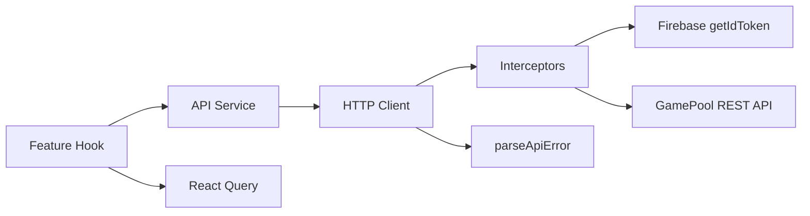
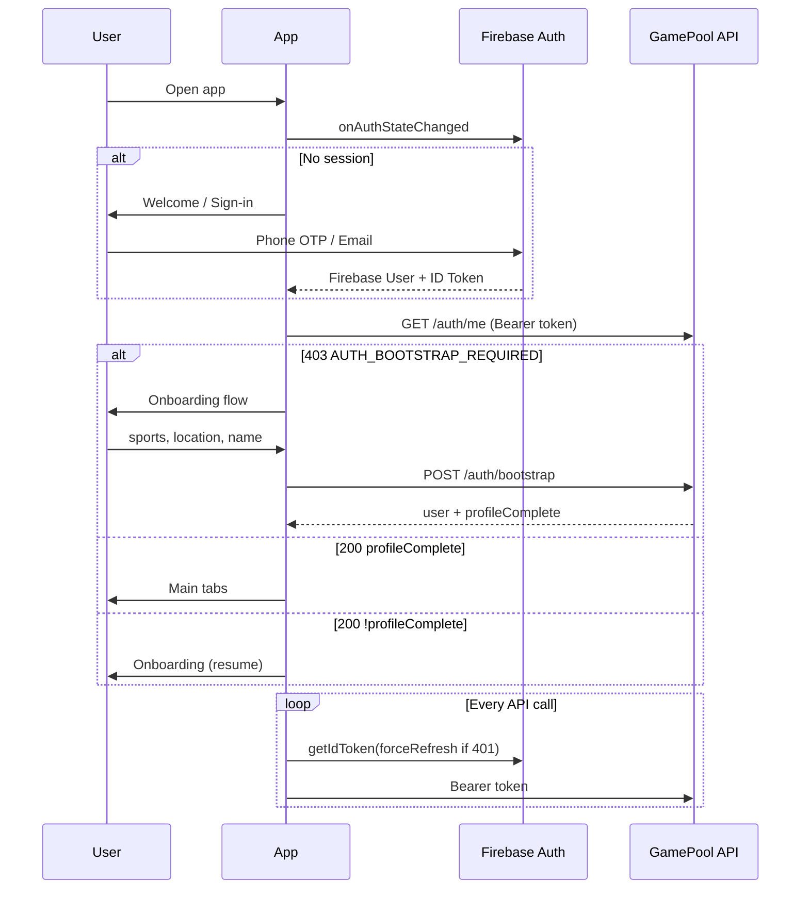
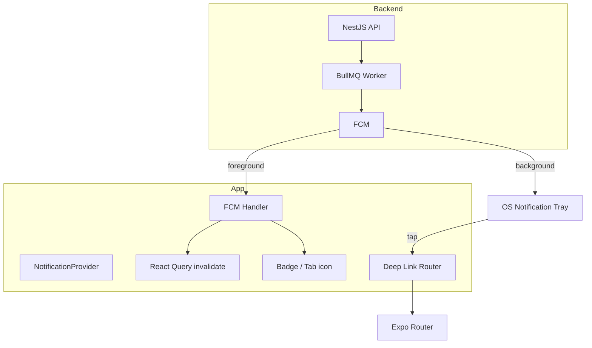
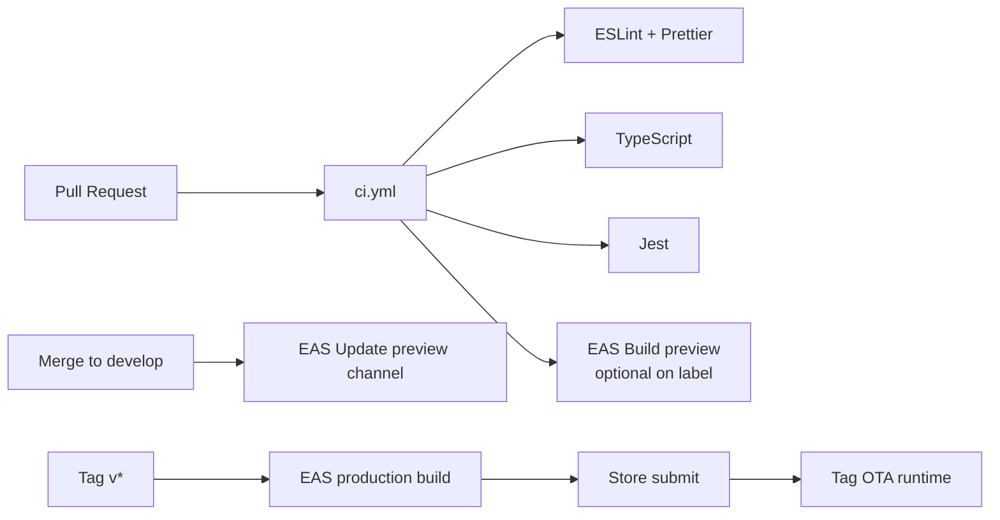

# GamePool — Mobile Architecture

**Version:** 1.0  
**Status:** Draft  
**Last Updated:** June 23, 2026  
**Stack:** React Native · Expo SDK 52+ · Expo Router · TypeScript · React Query · Zustand · NativeWind · Firebase Auth · FCM

---

## Document Summary

This document defines the production-ready React Native (Expo) mobile architecture for GamePool MVP. The app is **mobile-first**, aligned with the NestJS API ([`api-contract.md`](./api-contract.md)) and backend design ([`backend-architecture.md`](./backend-architecture.md)). Server state lives in **TanStack Query**; ephemeral and session state in **Zustand**; navigation via **Expo Router** file-based routes.

---

## Architecture Principles

| Principle | Implementation |
|-----------|----------------|
| Feature-first modules | Colocate screens, hooks, components per domain |
| Server vs client state | React Query for API data; Zustand for auth, UI, draft forms |
| Thin screens | Screens compose hooks + presentational components |
| Type-safe API | Generated/shared types from OpenAPI (or hand-maintained `types/api/`) |
| Offline-first reads | Query cache + persisted client; graceful degradation on writes |
| Single auth source | Firebase Auth SDK; ID token injected into API client |
| Fail gracefully | Global error boundary + typed API errors + retry UX |
| Performance by default | FlashList, memoization, image caching, query stale times |

---

## 1. Folder Structure

```
gamepool-mobile/
├── .github/
│   └── workflows/
│       ├── ci.yml                    # Lint, typecheck, unit tests
│       ├── eas-build-preview.yml     # PR preview builds
│       └── eas-build-production.yml  # Store release on tag
│
├── app/                              # Expo Router (file-based routes)
│   ├── _layout.tsx                   # Root layout: providers, fonts, splash
│   ├── index.tsx                     # Entry redirect (auth gate)
│   │
│   ├── (auth)/                       # Unauthenticated stack
│   │   ├── _layout.tsx
│   │   ├── welcome.tsx               # S01
│   │   ├── sign-in.tsx               # S02/S04
│   │   └── verify-otp.tsx            # S03
│   │
│   ├── (onboarding)/                 # Post-Firebase, pre-app
│   │   ├── _layout.tsx
│   │   ├── sports.tsx                # S05
│   │   ├── skill.tsx                 # S06
│   │   ├── location.tsx              # S07
│   │   └── availability.tsx          # S08 (optional P1)
│   │
│   ├── (tabs)/                       # Main app — bottom tabs
│   │   ├── _layout.tsx               # Tab navigator
│   │   ├── index.tsx                 # S09 Home / Discover
│   │   ├── explore.tsx               # S10–S12 Find players/teammates/opponents
│   │   ├── my-games.tsx              # S14 My Games
│   │   ├── notifications.tsx           # S16 Notifications
│   │   └── profile.tsx               # S15 Profile (self)
│   │
│   ├── match/
│   │   ├── create.tsx                # S21–S23 (multi-step wizard)
│   │   └── [matchId]/
│   │       ├── index.tsx             # S24 Match detail
│   │       ├── manage.tsx            # S25 Host manage
│   │       └── participants.tsx      # Roster view
│   │
│   ├── user/
│   │   └── [userId].tsx              # S18 Public profile
│   │
│   ├── settings/
│   │   ├── index.tsx                 # S17 Settings
│   │   └── preferences.tsx           # Notification prefs
│   │
│   └── +not-found.tsx
│
├── src/
│   ├── components/
│   │   ├── ui/                       # Design system (NativeWind)
│   │   │   ├── Button.tsx
│   │   │   ├── Input.tsx
│   │   │   ├── Card.tsx
│   │   │   ├── Badge.tsx
│   │   │   ├── Avatar.tsx
│   │   │   ├── Skeleton.tsx
│   │   │   ├── EmptyState.tsx
│   │   │   └── ErrorState.tsx
│   │   ├── match/
│   │   │   ├── MatchCard.tsx
│   │   │   ├── MatchFilters.tsx
│   │   │   ├── ParticipantList.tsx
│   │   │   └── JoinMatchButton.tsx
│   │   ├── user/
│   │   │   ├── UserCard.tsx
│   │   │   ├── SportChip.tsx
│   │   │   └── ProfileHeader.tsx
│   │   ├── notification/
│   │   │   └── NotificationItem.tsx
│   │   └── layout/
│   │       ├── Screen.tsx            # SafeArea + scroll wrapper
│   │       ├── Header.tsx
│   │       └── TabBar.tsx
│   │
│   ├── features/                     # Feature logic (hooks + feature components)
│   │   ├── auth/
│   │   │   ├── hooks/
│   │   │   │   ├── useAuth.ts
│   │   │   │   ├── useSignIn.ts
│   │   │   │   └── useBootstrap.ts
│   │   │   └── components/
│   │   │       └── PhoneInput.tsx
│   │   ├── onboarding/
│   │   │   └── hooks/
│   │   │       └── useOnboarding.ts
│   │   ├── matches/
│   │   │   ├── hooks/
│   │   │   │   ├── useMatches.ts
│   │   │   │   ├── useMatch.ts
│   │   │   │   ├── useCreateMatch.ts
│   │   │   │   ├── useJoinMatch.ts
│   │   │   │   └── useMatchParticipants.ts
│   │   │   └── components/
│   │   ├── users/
│   │   │   ├── hooks/
│   │   │   │   ├── useProfile.ts
│   │   │   │   ├── useUpdateProfile.ts
│   │   │   │   └── usePlayerSearch.ts
│   │   │   └── components/
│   │   ├── sports/
│   │   │   └── hooks/
│   │   │       └── useSports.ts
│   │   └── notifications/
│   │       ├── hooks/
│   │       │   ├── useNotifications.ts
│   │       │   └── useUnreadCount.ts
│   │       └── components/
│   │
│   ├── lib/
│   │   ├── api/
│   │   │   ├── client.ts             # Axios/fetch wrapper + interceptors
│   │   │   ├── query-client.ts       # React Query config
│   │   │   ├── endpoints.ts          # Route constants
│   │   │   └── services/
│   │   │       ├── auth.service.ts
│   │   │       ├── users.service.ts
│   │   │       ├── sports.service.ts
│   │   │       ├── matches.service.ts
│   │   │       └── notifications.service.ts
│   │   ├── firebase/
│   │   │   ├── config.ts
│   │   │   ├── auth.ts
│   │   │   └── messaging.ts
│   │   ├── storage/
│   │   │   ├── secure-store.ts       # expo-secure-store (tokens metadata)
│   │   │   └── mmkv.ts               # Fast prefs + offline queue
│   │   ├── notifications/
│   │   │   ├── fcm-handler.ts
│   │   │   ├── deep-links.ts
│   │   │   └── badge.ts
│   │   ├── offline/
│   │   │   ├── network.ts            # @react-native-community/netinfo
│   │   │   ├── queue.ts              # Mutation retry queue
│   │   │   └── persist-query.ts
│   │   └── utils/
│   │       ├── date.ts
│   │       ├── errors.ts
│   │       └── idempotency.ts
│   │
│   ├── stores/                       # Zustand
│   │   ├── auth.store.ts
│   │   ├── onboarding.store.ts
│   │   ├── ui.store.ts
│   │   └── filters.store.ts
│   │
│   ├── types/
│   │   ├── api/                      # API DTOs (mirror backend)
│   │   │   ├── auth.ts
│   │   │   ├── user.ts
│   │   │   ├── match.ts
│   │   │   ├── sport.ts
│   │   │   ├── notification.ts
│   │   │   └── common.ts             # ApiResponse, PaginatedMeta, ApiError
│   │   └── navigation.ts
│   │
│   ├── constants/
│   │   ├── config.ts
│   │   ├── query-keys.ts
│   │   └── theme.ts
│   │
│   └── providers/
│       ├── AppProviders.tsx          # Composes all providers
│       ├── AuthProvider.tsx
│       ├── QueryProvider.tsx
│       └── NotificationProvider.tsx
│
├── assets/
│   ├── fonts/
│   ├── images/
│   └── icons/
│
├── plugins/                          # Expo config plugins (if custom)
│
├── app.config.ts                     # Expo dynamic config
├── eas.json                          # EAS Build profiles
├── babel.config.js
├── tailwind.config.js                # NativeWind
├── global.css
├── metro.config.js
├── tsconfig.json
├── package.json
└── .env.example
```

### Layer Responsibilities

| Layer | Path | Responsibility |
|-------|------|----------------|
| **Routes** | `app/` | Screens, layouts, deep-link targets; minimal logic |
| **Features** | `src/features/` | Domain hooks, feature-specific UI |
| **Components** | `src/components/` | Reusable presentational UI |
| **Lib** | `src/lib/` | API, Firebase, storage, offline, utilities |
| **Stores** | `src/stores/` | Client/session state (Zustand) |
| **Types** | `src/types/` | TypeScript contracts |

---

## 2. Navigation Architecture

### 2.1 Route Groups Overview

```mermaid
flowchart TD
    Root[app/_layout.tsx] --> Index[app/index.tsx<br/>Auth Gate]

    Index -->|No Firebase session| Auth["(auth)"]
    Index -->|Session + incomplete profile| Onboarding["(onboarding)"]
    Index -->|Session + complete| Tabs["(tabs)"]

    Auth --> Welcome[welcome]
    Auth --> SignIn[sign-in]
    Auth --> OTP[verify-otp]

    Onboarding --> Sports[sports → skill → location]

    Tabs --> Home[index]
    Tabs --> Explore[explore]
    Tabs --> MyGames[my-games]
    Tabs --> Notif[notifications]
    Tabs --> Profile[profile]

    Tabs --> MatchStack[match/*]
    Tabs --> UserStack[user/[userId]]
    Tabs --> Settings[settings/*]
```

### 2.2 Auth Gate (`app/index.tsx`)

Central routing decision on app launch and auth state change:

```typescript
// Pseudologic
const { firebaseUser, isLoading } = useAuth();
const { data: me, isLoading: meLoading } = useAuthMe({ enabled: !!firebaseUser });

if (isLoading || meLoading) return <SplashScreen />;
if (!firebaseUser) return <Redirect href="/(auth)/welcome" />;
if (!me?.profileComplete) return <Redirect href="/(onboarding)/sports" />;
return <Redirect href="/(tabs)" />;
```

### 2.3 Tab Navigator (`app/(tabs)/_layout.tsx`)

| Tab | Route | Icon | Badge |
|-----|-------|------|-------|
| Home | `index` | home | — |
| Explore | `explore` | search | — |
| My Games | `my-games` | calendar | upcoming count (optional) |
| Alerts | `notifications` | bell | unread count |
| Profile | `profile` | user | — |

**FAB (host):** Floating action on Home + My Games → `router.push('/match/create')`.

### 2.4 Stack Modals & Presentation

| Screen | Presentation | Route |
|--------|--------------|-------|
| Create match wizard | Full-screen stack | `/match/create` |
| Match detail | Push stack | `/match/[matchId]` |
| Host manage | Push stack | `/match/[matchId]/manage` |
| User profile | Push stack | `/user/[userId]` |
| Settings | Push stack | `/settings` |

Configure in `app/_layout.tsx`:

```typescript
<Stack screenOptions={{ headerShown: false }}>
  <Stack.Screen name="(auth)" />
  <Stack.Screen name="(onboarding)" />
  <Stack.Screen name="(tabs)" />
  <Stack.Screen name="match/create" options={{ presentation: 'modal' }} />
  <Stack.Screen name="match/[matchId]" />
</Stack>
```

### 2.5 Deep Linking (Expo Router + FCM)

**Scheme:** `gamepool://`  
**Universal links:** `https://gamepool.app/...`

| Path | Screen |
|------|--------|
| `gamepool://match/:matchId` | `/match/[matchId]` |
| `gamepool://user/:userId` | `/user/[userId]` |
| `gamepool://notifications` | `/(tabs)/notifications` |

`app.config.ts`:

```typescript
export default {
  scheme: 'gamepool',
  linking: {
    prefixes: ['gamepool://', 'https://gamepool.app'],
  },
};
```

### 2.6 Navigation Guards

| Guard | Location | Rule |
|-------|----------|------|
| Auth required | `(tabs)/*`, `match/*` | Redirect to `/(auth)/welcome` if no Firebase user |
| Profile complete | `(tabs)/*` | Redirect to onboarding if `!profileComplete` |
| Host only | `match/[id]/manage` | Redirect if `match.host.id !== currentUser.id` |

Implemented via layout-level hooks, not scattered in screens.

---

## 3. State Management Architecture

### 3.1 State Ownership Matrix

| State Type | Tool | Examples | Persistence |
|------------|------|----------|-------------|
| **Server / remote** | React Query | Matches, profile, notifications, sports | AsyncStorage persister (select queries) |
| **Auth session** | Zustand + Firebase | `firebaseUser`, `isAuthenticated` | Firebase handles token refresh |
| **Onboarding draft** | Zustand | Selected sports, city, skills mid-flow | MMKV until bootstrap |
| **UI ephemeral** | Zustand | Bottom sheet, toast queue, active tab | Memory only |
| **List filters** | Zustand | Match discovery filters, player search | MMKV (restore last filters) |
| **Form drafts** | Zustand or React Hook Form | Create match wizard step data | MMKV until submit |

### 3.2 Zustand Stores

#### `auth.store.ts`

```typescript
interface AuthState {
  isInitialized: boolean;
  firebaseUid: string | null;
  setFirebaseUid: (uid: string | null) => void;
  reset: () => void;
}
```

Firebase `onAuthStateChanged` is the source of truth; store mirrors for non-React consumers (API client).

#### `onboarding.store.ts`

```typescript
interface OnboardingState {
  displayName: string;
  city: string;
  area: string;
  sports: UserSportInput[];
  setField: <K extends keyof OnboardingState>(key: K, value: OnboardingState[K]) => void;
  reset: () => void;
}
```

#### `filters.store.ts`

```typescript
interface MatchFiltersState {
  sportId: string | null;
  city: string | null;
  status: MatchStatus[];
  startsAtFrom: string | null;
  reset: () => void;
}
```

#### `ui.store.ts`

```typescript
interface UiState {
  isOffline: boolean;
  globalBanner: { message: string; type: 'info' | 'error' } | null;
  setOffline: (v: boolean) => void;
}
```

### 3.3 React Query Conventions

**Query key factory** (`src/constants/query-keys.ts`):

```typescript
export const queryKeys = {
  auth: { me: ['auth', 'me'] as const },
  sports: { all: ['sports'] as const, detail: (id: string) => ['sports', id] as const },
  matches: {
    list: (filters: MatchFilters) => ['matches', 'list', filters] as const,
    detail: (id: string) => ['matches', 'detail', id] as const,
    participants: (id: string) => ['matches', id, 'participants'] as const,
  },
  users: {
    me: ['users', 'me'] as const,
    public: (id: string) => ['users', id] as const,
    search: (params: SearchParams) => ['users', 'search', params] as const,
    myMatches: (params: MyMatchesParams) => ['users', 'me', 'matches', params] as const,
  },
  notifications: {
    inbox: (page: number) => ['notifications', 'inbox', page] as const,
    unreadCount: ['notifications', 'unread-count'] as const,
  },
};
```

**Default query options:**

```typescript
export const queryClient = new QueryClient({
  defaultOptions: {
    queries: {
      staleTime: 30_000,           // 30s default
      gcTime: 5 * 60_000,          // 5 min cache
      retry: 2,
      refetchOnWindowFocus: true,
      refetchOnReconnect: true,
    },
    mutations: {
      retry: 0,
    },
  },
});
```

**Per-resource stale times:**

| Query | staleTime | Reason |
|-------|-----------|--------|
| Sports catalog | 1 hour | Rarely changes |
| Match list | 30s | Discovery freshness |
| Match detail | 15s | Roster changes |
| Notifications unread | 10s | Badge accuracy |
| User profile (me) | 60s | Moderate churn |

### 3.4 Cache Invalidation Map

| Mutation | Invalidate |
|----------|------------|
| `bootstrap` | `auth.me`, `users.me` |
| `joinMatch` | `matches.detail`, `matches.list`, `users.myMatches` |
| `createMatch` | `matches.list`, `users.myMatches` |
| `approveParticipant` | `matches.detail`, `matches.participants` |
| `markNotificationRead` | `notifications.inbox`, `notifications.unreadCount` |

---

## 4. API Layer Design

### 4.1 Architecture



### 4.2 HTTP Client (`src/lib/api/client.ts`)

```typescript
import axios, { AxiosError } from 'axios';
import { getIdToken } from '@/lib/firebase/auth';
import { parseApiError } from '@/lib/utils/errors';
import { generateRequestId } from '@/lib/utils/idempotency';

const apiClient = axios.create({
  baseURL: process.env.EXPO_PUBLIC_API_URL, // https://api.gamepool.app/v1
  timeout: 15_000,
  headers: { Accept: 'application/json', 'Content-Type': 'application/json' },
});

apiClient.interceptors.request.use(async (config) => {
  config.headers['X-Request-Id'] = generateRequestId();
  const token = await getIdToken();
  if (token) config.headers.Authorization = `Bearer ${token}`;
  return config;
});

apiClient.interceptors.response.use(
  (res) => res.data, // unwrap axios; services receive ApiResponse<T>
  (error: AxiosError<ApiErrorResponse>) => {
    throw parseApiError(error);
  },
);

export { apiClient };
```

### 4.3 Service Layer Pattern

```typescript
// src/lib/api/services/matches.service.ts
export const matchesService = {
  list: (params: MatchListParams) =>
    apiClient.get<unknown, PaginatedResponse<MatchListItem>>('/matches', { params }),

  getById: (matchId: string) =>
    apiClient.get<unknown, ApiResponse<MatchDetail>>(`/matches/${matchId}`),

  create: (body: CreateMatchDto) =>
    apiClient.post<unknown, ApiResponse<MatchDetail>>('/matches', body),

  join: (matchId: string, body?: JoinMatchDto, idempotencyKey?: string) =>
    apiClient.post<unknown, ApiResponse<JoinMatchResponse>>(`/matches/${matchId}/join`, body, {
      headers: idempotencyKey ? { 'X-Idempotency-Key': idempotencyKey } : {},
    }),
};
```

### 4.4 Type Definitions (`src/types/api/common.ts`)

```typescript
export interface ApiResponse<T> {
  data: T;
  meta?: PaginatedMeta;
  links?: PaginationLinks;
}

export interface ApiError {
  code: string;
  message: string;
  status: number;
  details?: { field: string; message: string }[];
  requestId?: string;
}

export type ApiErrorCode =
  | 'AUTH_TOKEN_EXPIRED'
  | 'MATCH_FULL'
  | 'PROFILE_INCOMPLETE'
  | 'VALIDATION_FAILED'
  // ... mirror api-contract.md
  ;
```

### 4.5 Feature Hook Pattern

```typescript
// src/features/matches/hooks/useJoinMatch.ts
export function useJoinMatch(matchId: string) {
  const queryClient = useQueryClient();

  return useMutation({
    mutationFn: () =>
      matchesService.join(matchId, undefined, generateIdempotencyKey()),
    onSuccess: () => {
      queryClient.invalidateQueries({ queryKey: queryKeys.matches.detail(matchId) });
      queryClient.invalidateQueries({ queryKey: ['matches', 'list'] });
    },
    onError: (error: AppError) => {
      if (error.code === 'MATCH_FULL') {
        // UI-specific handling via toast
      }
    },
  });
}
```

### 4.6 Environment Configuration

| Variable | Example | Notes |
|----------|---------|-------|
| `EXPO_PUBLIC_API_URL` | `https://api.gamepool.app/v1` | Staging via EAS env |
| `EXPO_PUBLIC_FIREBASE_*` | Firebase web config | Per environment |
| `EXPO_PUBLIC_APP_ENV` | `development` \| `staging` \| `production` | Feature flags |

---

## 5. Authentication Flow

### 5.1 End-to-End Flow



### 5.2 Firebase Auth Implementation

```typescript
// src/lib/firebase/auth.ts
import {
  getAuth,
  signInWithPhoneNumber,
  PhoneAuthProvider,
  onAuthStateChanged,
  signOut,
} from '@react-native-firebase/auth';

export async function getIdToken(forceRefresh = false): Promise<string | null> {
  const user = getAuth().currentUser;
  if (!user) return null;
  return user.getIdToken(forceRefresh);
}

export function subscribeAuthState(callback: (user: FirebaseAuthTypes.User | null) => void) {
  return onAuthStateChanged(getAuth(), callback);
}
```

> **Expo:** Use `@react-native-firebase/auth` with EAS dev client (not Expo Go for production Firebase native modules). Alternative for early dev: `expo-firebase-recaptcha` + REST — migrate to native before release.

### 5.3 Auth Provider

```typescript
// src/providers/AuthProvider.tsx
export function AuthProvider({ children }: { children: React.ReactNode }) {
  const [isLoading, setIsLoading] = useState(true);
  const { setFirebaseUid, reset } = useAuthStore();

  useEffect(() => {
    const unsub = subscribeAuthState((user) => {
      setFirebaseUid(user?.uid ?? null);
      if (!user) reset();
      setIsLoading(false);
    });
    return unsub;
  }, []);

  const { data: me, isLoading: meLoading } = useQuery({
    queryKey: queryKeys.auth.me,
    queryFn: () => authService.getMe(),
    enabled: !isLoading && !!useAuthStore.getState().firebaseUid,
    retry: (count, err) => err.code !== 'AUTH_BOOTSTRAP_REQUIRED' && count < 2,
  });

  return (
    <AuthContext.Provider value={{ isLoading: isLoading || meLoading, me }}>
      {children}
    </AuthContext.Provider>
  );
}
```

### 5.4 Token Refresh on 401

```typescript
apiClient.interceptors.response.use(undefined, async (error) => {
  if (error.response?.status === 401 && error.config && !error.config._retry) {
    error.config._retry = true;
    const token = await getIdToken(true);
    if (token) {
      error.config.headers.Authorization = `Bearer ${token}`;
      return apiClient.request(error.config);
    }
    await signOut();
    router.replace('/(auth)/welcome');
  }
  return Promise.reject(parseApiError(error));
});
```

### 5.5 Sign-Out Flow

```
1. Call DELETE /auth/session (best-effort)
2. firebase.signOut()
3. queryClient.clear()
4. Reset Zustand stores (auth, onboarding, filters)
5. router.replace('/(auth)/welcome')
```

### 5.6 Secure Storage

| Data | Storage | Reason |
|------|---------|--------|
| Firebase session | Firebase SDK internal | Managed by SDK |
| Onboarding draft | MMKV | Non-sensitive |
| Last known user id | SecureStore | Optional, for analytics |
| FCM token | MMKV + API registration | Synced to backend |

**Never store Firebase ID tokens manually** — always call `getIdToken()` at request time.

---

## 6. Notification Flow

### 6.1 FCM Architecture



### 6.2 Setup (`src/lib/firebase/messaging.ts`)

```typescript
import messaging from '@react-native-firebase/messaging';
import * as Notifications from 'expo-notifications';

export async function registerForPushNotifications(): Promise<string | null> {
  const authStatus = await messaging().requestPermission();
  if (authStatus !== messaging.AuthorizationStatus.AUTHORIZED) return null;

  const token = await messaging().getToken();
  await usersService.registerDeviceToken({ token, platform: Platform.OS });
  return token;
}

export function setupNotificationHandlers() {
  // Foreground: show in-app banner
  messaging().onMessage(async (remoteMessage) => {
    showInAppNotification(remoteMessage);
    queryClient.invalidateQueries({ queryKey: queryKeys.notifications.unreadCount });
  });

  // Background open
  messaging().onNotificationOpenedApp((msg) => {
    handleNotificationDeepLink(msg.data);
  });

  // Quit state open
  messaging().getInitialNotification().then((msg) => {
    if (msg) handleNotificationDeepLink(msg.data);
  });

  // Token refresh
  messaging().onTokenRefresh(async (token) => {
    await usersService.registerDeviceToken({ token, platform: Platform.OS });
  });
}
```

### 6.3 Notification Payload → Navigation

```typescript
// src/lib/notifications/deep-links.ts
export function handleNotificationDeepLink(data: Record<string, string>) {
  switch (data.type) {
    case 'MATCH_JOIN_REQUEST':
    case 'MATCH_CANCELLED':
    case 'MATCH_REMINDER':
      if (data.matchId) router.push(`/match/${data.matchId}`);
      break;
    case 'MATCH_JOIN_APPROVED':
    case 'MATCH_JOIN_DECLINED':
      if (data.matchId) router.push(`/match/${data.matchId}`);
      break;
    default:
      router.push('/(tabs)/notifications');
  }
}
```

### 6.4 NotificationProvider

Mounts after auth + profile complete:

1. `registerForPushNotifications()`
2. `setupNotificationHandlers()`
3. Sync unread badge: `useUnreadCount()` → `Notifications.setBadgeCountAsync()`

### 6.5 In-App Inbox

- `useNotifications(page)` → infinite query or paginated `GET /v1/notifications`
- Pull-to-refresh + `refetchOnFocus`
- Swipe actions: mark read (PATCH), delete (DELETE)
- Tap row → deep link via `payload.matchId`

### 6.6 Permission UX

| Stage | Action |
|-------|--------|
| After onboarding complete | Soft prompt explaining value |
| On first "My Games" visit | System permission dialog |
| Denied | Settings deep link banner; in-app inbox still works |

---

## 7. Offline Strategy

### 7.1 Offline Tiers

| Tier | Behavior | Data |
|------|----------|------|
| **T1 Cached read** | Show stale data + "Last updated" banner | Matches list, profile, my games |
| **T2 Optimistic write** | Queue mutation, rollback on failure | Join match (with idempotency key) |
| **T3 Blocked write** | Disable CTA + explain | Create match, publish, approve |
| **T4 Auth** | Require connectivity | Sign-in, bootstrap |

### 7.2 Network Detection

```typescript
// src/lib/offline/network.ts
import NetInfo from '@react-native-community/netinfo';

NetInfo.addEventListener((state) => {
  useUiStore.getState().setOffline(!state.isConnected);
});
```

Global offline banner in `app/_layout.tsx` when `ui.isOffline`.

### 7.3 React Query Persistence

```typescript
import { createAsyncStoragePersister } from '@tanstack/query-async-storage-persister';
import AsyncStorage from '@react-native-async-storage/async-storage';

const persister = createAsyncStoragePersister({ storage: AsyncStorage });

<PersistQueryClientProvider
  client={queryClient}
  persistOptions={{
    persister,
    maxAge: 24 * 60 * 60 * 1000,
    dehydrateOptions: {
      shouldDehydrateQuery: (query) =>
        ['matches', 'users', 'sports'].some((k) => query.queryKey[0] === k),
    },
  }}
>
```

### 7.4 Offline Mutation Queue

For critical actions when offline:

```typescript
interface QueuedMutation {
  id: string;
  type: 'JOIN_MATCH';
  payload: { matchId: string; idempotencyKey: string };
  createdAt: number;
}

// On reconnect: flush queue FIFO with idempotency keys preserved
```

Store queue in MMKV; process in `NetInfo` reconnect handler.

### 7.5 UX Patterns

| State | UI |
|-------|-----|
| Offline + cached data | Yellow banner: "You're offline. Showing saved data." |
| Offline + no cache | `ErrorState` with retry |
| Stale data (>5 min offline) | Subtle timestamp on list header |
| Write while offline | Toast: "We'll sync when you're back online" (if queued) |

### 7.6 My Games Offline Priority

Persist aggressively — users need match time/venue on match day without network:

- `users.me.matches` with `staleTime: Infinity` when offline
- Match detail for joined upcoming matches prefetched on app foreground

```typescript
// Prefetch on app focus
queryClient.prefetchQuery({
  queryKey: queryKeys.matches.detail(upcomingMatchId),
});
```

---

## 8. Build & Release Strategy

### 8.1 Expo Workflow

| Workflow | Use |
|----------|-----|
| **Development** | `expo start` + EAS Dev Client |
| **Preview** | EAS Build `preview` profile → internal TestFlight / APK |
| **Production** | EAS Build `production` → App Store + Play Store |

**Not Expo Go for production** — native Firebase modules require custom dev client.

### 8.2 App Identifiers

| Platform | Development | Staging | Production |
|----------|-------------|---------|------------|
| iOS bundle ID | `app.gamepool.dev` | `app.gamepool.staging` | `app.gamepool` |
| Android package | `app.gamepool.dev` | `app.gamepool.staging` | `app.gamepool` |

### 8.3 Versioning

| Field | Format | Example |
|-------|--------|---------|
| `version` (user-facing) | Semver | `1.0.0` |
| iOS `buildNumber` | Integer, auto-increment EAS | `42` |
| Android `versionCode` | Integer, auto-increment EAS | `42` |

### 8.4 Release Channels

| Channel | Branch | Audience |
|---------|--------|----------|
| `development` | feature/* | Engineers |
| `preview` | develop | QA, stakeholders |
| `production` | main + tag | Public stores |

### 8.5 OTA Updates (Expo Updates)

| Change type | Delivery |
|-------------|----------|
| JS/UI bugfix | EAS Update → `preview` / `production` channel |
| Native module / SDK bump | Full EAS Build required |
| Firebase config change | Rebuild if native config plugin changes |

**MVP policy:** OTA for JS-only; full build for each store release.

### 8.6 Store Release Checklist

- [ ] EAS production build (iOS + Android)
- [ ] TestFlight / Internal testing soak (48h)
- [ ] Screenshot + metadata updated
- [ ] Privacy policy URL live
- [ ] Firebase production project + APNs key configured
- [ ] API pointing to production (`EXPO_PUBLIC_API_URL`)
- [ ] Rollback build id documented

---

## 9. EAS Deployment

### 9.1 `eas.json`

```json
{
  "cli": {
    "version": ">= 12.0.0",
    "appVersionSource": "remote"
  },
  "build": {
    "development": {
      "developmentClient": true,
      "distribution": "internal",
      "ios": { "simulator": true },
      "env": {
        "EXPO_PUBLIC_APP_ENV": "development",
        "EXPO_PUBLIC_API_URL": "https://api.staging.gamepool.app/v1"
      }
    },
    "preview": {
      "distribution": "internal",
      "channel": "preview",
      "ios": { "simulator": false },
      "android": { "buildType": "apk" },
      "env": {
        "EXPO_PUBLIC_APP_ENV": "staging",
        "EXPO_PUBLIC_API_URL": "https://api.staging.gamepool.app/v1"
      }
    },
    "production": {
      "channel": "production",
      "autoIncrement": true,
      "ios": { "resourceClass": "m-medium" },
      "android": { "buildType": "app-bundle" },
      "env": {
        "EXPO_PUBLIC_APP_ENV": "production",
        "EXPO_PUBLIC_API_URL": "https://api.gamepool.app/v1"
      }
    }
  },
  "submit": {
    "production": {
      "ios": {
        "appleId": "release@gamepool.app",
        "ascAppId": "YOUR_ASC_APP_ID",
        "appleTeamId": "YOUR_TEAM_ID"
      },
      "android": {
        "serviceAccountKeyPath": "./google-play-service-account.json",
        "track": "internal"
      }
    }
  }
}
```

### 9.2 `app.config.ts` (dynamic)

```typescript
import { ExpoConfig, ConfigContext } from 'expo/config';

export default ({ config }: ConfigContext): ExpoConfig => ({
  ...config,
  name: process.env.EXPO_PUBLIC_APP_ENV === 'production' ? 'GamePool' : 'GamePool (Dev)',
  slug: 'gamepool',
  version: '1.0.0',
  orientation: 'portrait',
  scheme: 'gamepool',
  userInterfaceStyle: 'automatic',
  ios: {
    bundleIdentifier: process.env.IOS_BUNDLE_ID ?? 'app.gamepool.dev',
    googleServicesFile: process.env.GOOGLE_SERVICES_IOS ?? './GoogleService-Info.plist',
    infoPlist: {
      UIBackgroundModes: ['remote-notification'],
    },
  },
  android: {
    package: process.env.ANDROID_PACKAGE ?? 'app.gamepool.dev',
    googleServicesFile: process.env.GOOGLE_SERVICES_ANDROID ?? './google-services.json',
  },
  plugins: [
    'expo-router',
    '@react-native-firebase/app',
    '@react-native-firebase/auth',
    '@react-native-firebase/messaging',
    [
      'expo-notifications',
      { icon: './assets/icons/notification-icon.png', color: '#16A34A' },
    ],
  ],
  extra: {
    eas: { projectId: 'YOUR_EAS_PROJECT_ID' },
  },
  updates: {
    url: 'https://u.expo.dev/YOUR_EAS_PROJECT_ID',
  },
  runtimeVersion: { policy: 'appVersion' },
});
```

### 9.3 EAS Secrets (per environment)

| Secret | Profiles |
|--------|----------|
| `GOOGLE_SERVICES_IOS` | File env (base64 plist) |
| `GOOGLE_SERVICES_ANDROID` | File env (base64 json) |
| `FIREBASE_*` | If using extra config |

```bash
eas secret:create --name GOOGLE_SERVICES_IOS --type file --value ./GoogleService-Info.plist
```

### 9.4 Common EAS Commands

```bash
# Dev client for local native module testing
eas build --profile development --platform ios

# QA build
eas build --profile preview --platform all

# Store release
eas build --profile production --platform all
eas submit --profile production --platform ios
eas submit --profile production --platform android

# OTA JS update to production channel
eas update --channel production --message "Fix match join toast"
```

---

## 10. CI/CD

### 10.1 Pipeline Overview



### 10.2 `.github/workflows/ci.yml`

```yaml
name: Mobile CI

on:
  pull_request:
    branches: [main, develop]
    paths: ['gamepool-mobile/**', '.github/workflows/ci.yml']

defaults:
  run:
    working-directory: gamepool-mobile

jobs:
  quality:
    runs-on: ubuntu-latest
    steps:
      - uses: actions/checkout@v4

      - uses: actions/setup-node@v4
        with:
          node-version: 20
          cache: npm
          cache-dependency-path: gamepool-mobile/package-lock.json

      - run: npm ci
      - run: npm run lint
      - run: npm run typecheck
      - run: npm test -- --coverage --ci

  eas-preview:
    if: contains(github.event.pull_request.labels.*.name, 'eas-preview')
    runs-on: ubuntu-latest
    needs: quality
    steps:
      - uses: actions/checkout@v4

      - uses: expo/expo-github-action@v8
        with:
          eas-version: latest
          token: ${{ secrets.EXPO_TOKEN }}

      - run: npm ci
        working-directory: gamepool-mobile

      - run: eas build --profile preview --platform android --non-interactive
        working-directory: gamepool-mobile
```

### 10.3 `.github/workflows/eas-build-production.yml`

```yaml
name: EAS Production Build

on:
  push:
    tags: ['mobile-v*.*.*']

jobs:
  build:
    runs-on: ubuntu-latest
    strategy:
      matrix:
        platform: [ios, android]
    steps:
      - uses: actions/checkout@v4

      - uses: expo/expo-github-action@v8
        with:
          eas-version: latest
          token: ${{ secrets.EXPO_TOKEN }}

      - run: npm ci
        working-directory: gamepool-mobile

      - name: Build ${{ matrix.platform }}
        run: eas build --profile production --platform ${{ matrix.platform }} --non-interactive
        working-directory: gamepool-mobile

  submit:
    needs: build
    runs-on: ubuntu-latest
    steps:
      - uses: actions/checkout@v4
      - uses: expo/expo-github-action@v8
        with:
          token: ${{ secrets.EXPO_TOKEN }}
      - run: eas submit --profile production --platform all --latest --non-interactive
        working-directory: gamepool-mobile
```

### 10.4 CI/CD Conventions

| Convention | Rule |
|------------|------|
| Mobile tag | `mobile-v1.0.0` (separate from API tags) |
| PR checks | Lint + typecheck + unit tests required |
| EAS preview | Label-gated to control build minutes |
| API contract | Optional: diff `openapi.json` in CI against mobile types |
| Maestro / Detox E2E | Post-MVP in `e2e/` workflow |

### 10.5 `package.json` Scripts

```json
{
  "scripts": {
    "start": "expo start",
    "android": "expo run:android",
    "ios": "expo run:ios",
    "lint": "eslint . --ext .ts,.tsx",
    "typecheck": "tsc --noEmit",
    "test": "jest",
    "test:watch": "jest --watch",
    "build:dev:ios": "eas build --profile development --platform ios",
    "build:preview": "eas build --profile preview --platform all",
    "build:prod": "eas build --profile production --platform all",
    "update:preview": "eas update --channel preview",
    "update:prod": "eas update --channel production"
  }
}
```

---

## Appendix A: Error Handling

### A.1 Error Hierarchy

```typescript
export class AppError extends Error {
  constructor(
    public code: ApiErrorCode,
    message: string,
    public status: number,
    public details?: ApiError['details'],
  ) {
    super(message);
  }
}

export function parseApiError(error: AxiosError<ApiErrorResponse>): AppError {
  const body = error.response?.data?.error;
  if (body) return new AppError(body.code as ApiErrorCode, body.message, body.status, body.details);
  if (!error.response) return new AppError('NETWORK_ERROR', 'No internet connection', 0);
  return new AppError('INTERNAL_ERROR', 'Something went wrong', error.response.status);
}
```

### A.2 User-Facing Error Map

| Code | User message | Action |
|------|--------------|--------|
| `AUTH_TOKEN_EXPIRED` | Session expired | Silent refresh → sign-in |
| `MATCH_FULL` | Match is full | Offer waitlist if enabled |
| `PROFILE_INCOMPLETE` | Complete your profile | Navigate to onboarding |
| `NETWORK_ERROR` | Check your connection | Retry button |
| `RATE_LIMIT_EXCEEDED` | Too many requests | Wait + retry |
| `VALIDATION_FAILED` | Show field errors | Inline form errors |

### A.3 Global Error Boundary

```typescript
// app/_layout.tsx
<ErrorBoundary FallbackComponent={FatalErrorScreen} onError={logToSentry}>
  <AppProviders>{/* ... */}</AppProviders>
</ErrorBoundary>
```

### A.4 Toast vs Inline

| Context | Pattern |
|---------|---------|
| Form validation | Inline field errors |
| Mutation failure | Toast + retry |
| Query failure (list) | `ErrorState` full screen |
| Background sync failure | Silent queue + banner |

---

## Appendix B: Performance Optimization

### B.1 List Rendering

- **`@shopify/flash-list`** for matches, players, notifications (not FlatList at scale)
- Fixed `estimatedItemSize` per list type
- `memo()` on `MatchCard`, `UserCard`, `NotificationItem`
- Stable `keyExtractor` using entity `id`

### B.2 Images

- `expo-image` with disk cache policy
- Avatar sizes: thumbnail (48), profile (96) — request appropriate CDN params
- Blurhash placeholders for avatars

### B.3 Bundle Size

- Path aliases `@/` — no deep relative imports
- Lazy load heavy screens: `match/create` wizard steps
- Analyze: `npx expo export --dump-sourcemap` + source-map-explorer

### B.4 React Query

- `placeholderData: keepPreviousData` on paginated lists
- Prefetch match detail on `MatchCard` press-in
- `select` to narrow re-renders: `useMatch(id, { select: (d) => d.data.capacity })`

### B.5 NativeWind / Re-renders

- Keep style classes static; avoid dynamic class string concatenation in hot paths
- Split filter state — `filters.store` updates don't re-render entire match list if using isolated `MatchFilters` subscription

### B.6 Startup Performance

| Step | Target |
|------|--------|
| Splash → auth check | < 500ms |
| Auth → tabs (cached me) | < 1s |
| Cold start to match list | < 2s |

- Defer non-critical: FCM registration after first frame
- Font loading via `expo-font` in root layout before hide splash

### B.7 Monitoring

| Tool | Purpose |
|------|---------|
| Sentry | Crashes, API breadcrumbs |
| Firebase Analytics | Funnels: signup → first join |
| React Query Devtools | Dev only |

---

## Appendix C: NativeWind Setup Summary

```javascript
// tailwind.config.js
module.exports = {
  content: ['./app/**/*.{tsx,ts}', './src/**/*.{tsx,ts}'],
  presets: [require('nativewind/preset')],
  theme: {
    extend: {
      colors: {
        primary: { DEFAULT: '#16A34A', dark: '#15803D' },
        surface: { DEFAULT: '#FFFFFF', dark: '#0F172A' },
      },
    },
  },
};
```

```typescript
// app/_layout.tsx
import '../global.css';
```

---

## Appendix D: Screen → Route Mapping (PRD)

| PRD | Route |
|-----|-------|
| S01 Welcome | `/(auth)/welcome` |
| S02–S04 Sign in | `/(auth)/sign-in`, `verify-otp` |
| S05–S08 Onboarding | `/(onboarding)/*` |
| S09 Home | `/(tabs)/index` |
| S10–S12 Explore | `/(tabs)/explore` |
| S14 My Games | `/(tabs)/my-games` |
| S15 Profile | `/(tabs)/profile` |
| S16 Notifications | `/(tabs)/notifications` |
| S17 Settings | `/settings` |
| S18 User profile | `/user/[userId]` |
| S21–S23 Create match | `/match/create` |
| S24 Match detail | `/match/[matchId]` |
| S25 Manage | `/match/[matchId]/manage` |

---

## Revision History

| Version | Date | Author | Changes |
|---------|------|--------|---------|
| 1.0 | 2026-06-23 | Engineering | Initial mobile architecture for MVP |
