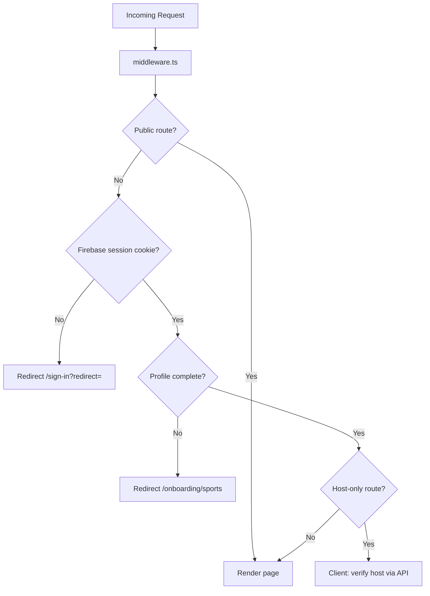
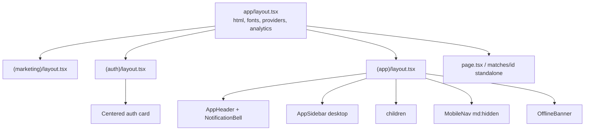
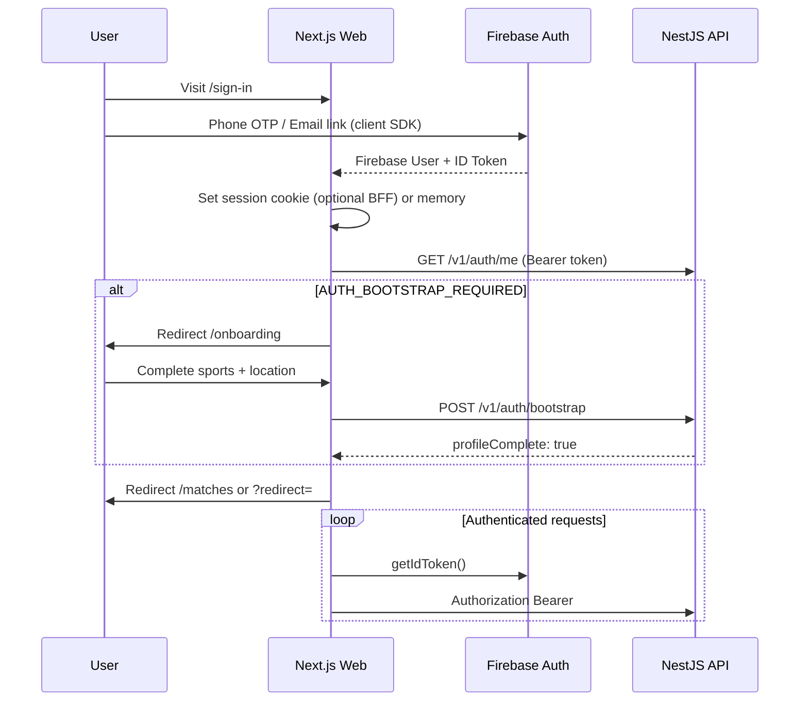
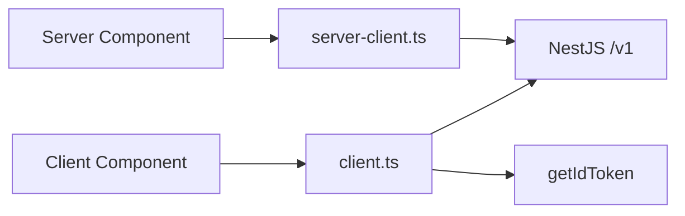
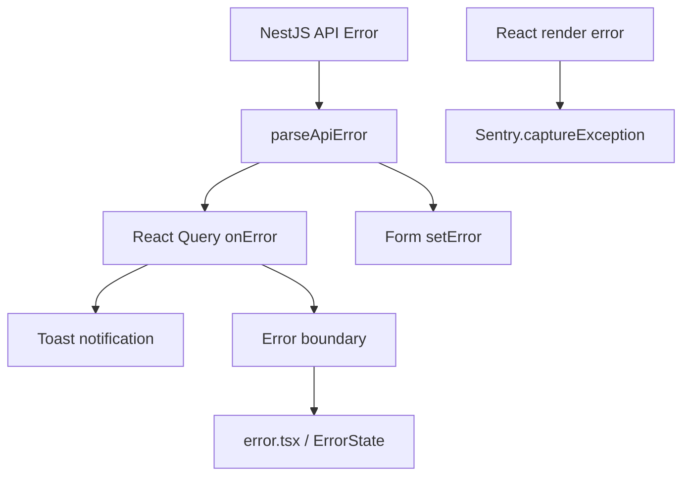
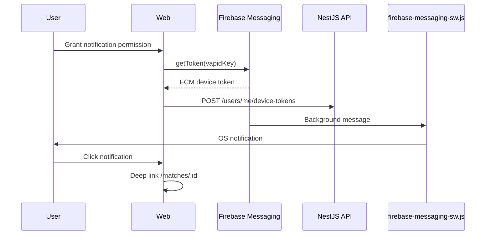
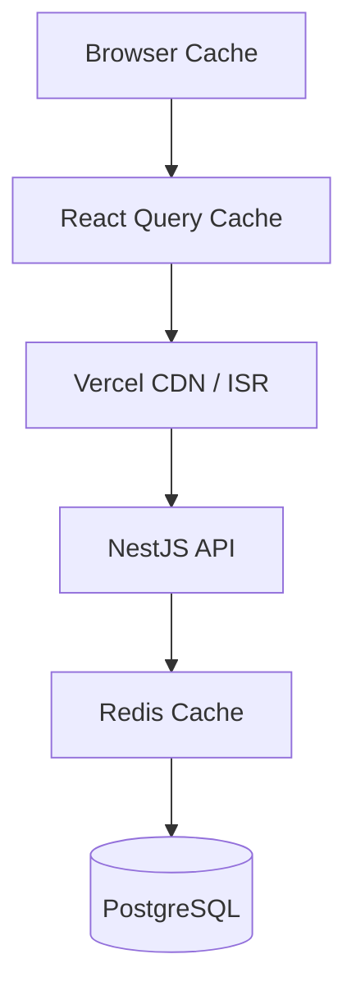
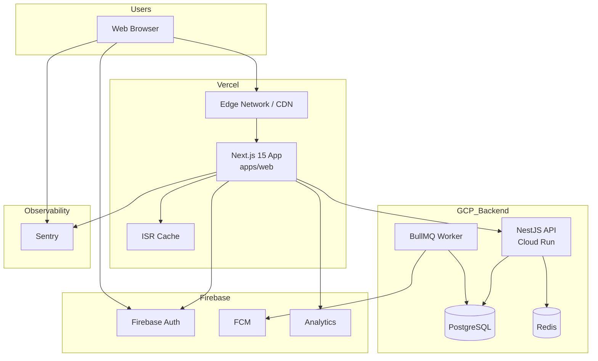
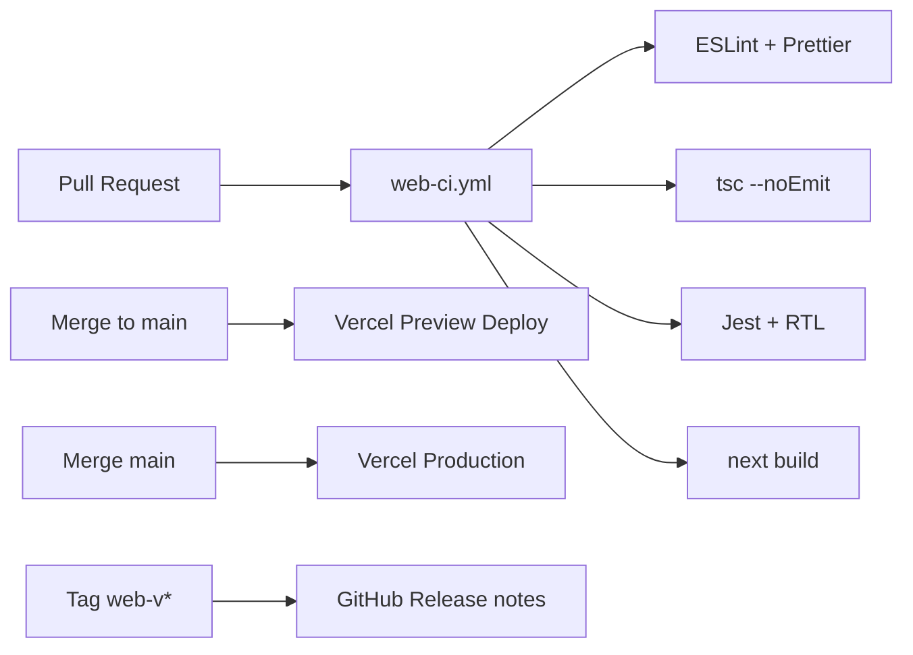

# GamePool — Web Architecture

**Version:** 1.0  
**Status:** Draft  
**Last Updated:** June 23, 2026  
**Stack:** Next.js 15 · App Router · TypeScript · TanStack Query · Zustand · TailwindCSS · shadcn/ui · Firebase Auth · Vercel

---

## Document Summary

This document defines the production-ready web application architecture for GamePool MVP. The web client is a **mobile-first responsive** Next.js 15 application that shares the NestJS REST API ([`api-contract.md`](./api-contract.md)) and Firebase authentication model with the React Native mobile app ([`mobile-architecture.md`](./mobile-architecture.md)). Server state is managed with **TanStack Query**; client/session state with **Zustand**; UI with **shadcn/ui** and **TailwindCSS**.

**Target scale:** 100k+ registered users, ~15k weekly web sessions, sub-2s LCP on 4G.

**Related documents:** [`PRD.md`](./PRD.md) · [`backend-architecture.md`](./backend-architecture.md) · [`database-design.md`](./database-design.md)

---

## 1. Architecture Principles

| Principle | Implementation |
|-----------|----------------|
| **API parity** | Web and mobile consume identical `/v1` endpoints, error codes, and envelopes |
| **Server-first rendering** | Public discovery pages use RSC + ISR; authenticated views hydrate client-side |
| **Feature colocation** | Domain logic in `src/features/*`; routes remain thin orchestrators |
| **Thin routes, fat features** | `page.tsx` composes feature components; no business logic in layouts |
| **Type safety end-to-end** | Shared API types in `src/types/api`; Zod schemas mirror backend DTOs |
| **Progressive enhancement** | Core browse works without JS; writes require client hydration |
| **Security by default** | Firebase tokens never in URLs; middleware for route gating; CSP headers |
| **Observable** | Sentry for errors; Firebase Analytics for funnels; structured client logs |
| **Performance budgets** | LCP < 2.5s, INP < 200ms, JS bundle < 200kB initial (gzipped target) |
| **Graceful degradation** | Offline banner, stale-while-revalidate reads, queued mutations where safe |

### Architectural Style

The web app follows a **hybrid layered architecture**:

```
┌─────────────────────────────────────────────────────────────┐
│  Presentation    app/ routes, layouts, loading.tsx, error.tsx │
├─────────────────────────────────────────────────────────────┤
│  Features        hooks, feature components, forms, schemas  │
├─────────────────────────────────────────────────────────────┤
│  Shared UI       components/ui (shadcn), layout shells      │
├─────────────────────────────────────────────────────────────┤
│  Infrastructure  lib/api, firebase, analytics, sentry       │
├─────────────────────────────────────────────────────────────┤
│  State           React Query (server) + Zustand (client)    │
└─────────────────────────────────────────────────────────────┘
                              │
                              ▼
                    NestJS API (api.gamepool.app)
```

---

## 2. Folder Structure

```
gamepool/                              # Monorepo root (recommended)
├── apps/
│   └── web/
│       ├── .github/
│       │   └── workflows/
│       │       ├── web-ci.yml
│       │       └── web-deploy.yml
│       │
│       ├── public/
│       │   ├── favicon.ico
│       │   ├── og-default.png
│       │   ├── manifest.json          # PWA manifest (post-MVP)
│       │   └── firebase-messaging-sw.js
│       │
│       ├── src/
│       │   ├── app/                   # Next.js App Router
│       │   │   ├── layout.tsx         # Root layout
│       │   │   ├── page.tsx           # Landing / home discover
│       │   │   ├── globals.css
│       │   │   ├── not-found.tsx
│       │   │   ├── error.tsx          # Root error boundary
│       │   │   ├── loading.tsx
│       │   │   │
│       │   │   ├── (marketing)/       # Public, no auth
│       │   │   │   ├── layout.tsx
│       │   │   │   ├── about/
│       │   │   │   └── privacy/
│       │   │   │
│       │   │   ├── (auth)/            # Sign-in flow
│       │   │   │   ├── layout.tsx
│       │   │   │   ├── sign-in/
│       │   │   │   │   └── page.tsx
│       │   │   │   ├── verify/
│       │   │   │   │   └── page.tsx
│       │   │   │   └── onboarding/
│       │   │   │       ├── sports/page.tsx
│       │   │   │       ├── skills/page.tsx
│       │   │   │       └── location/page.tsx
│       │   │   │
│       │   │   ├── (app)/             # Authenticated shell
│       │   │   │   ├── layout.tsx       # App shell + nav
│       │   │   │   ├── matches/
│       │   │   │   │   ├── page.tsx           # Discover matches
│       │   │   │   │   ├── create/
│       │   │   │   │   │   └── page.tsx
│       │   │   │   │   └── [matchId]/
│       │   │   │   │       ├── page.tsx       # Match detail
│       │   │   │   │       ├── loading.tsx
│       │   │   │   │       ├── error.tsx
│       │   │   │   │       └── manage/
│       │   │   │   │           └── page.tsx   # Host manage
│       │   │   │   ├── players/
│       │   │   │   │   ├── page.tsx           # Find players
│       │   │   │   │   └── [userId]/
│       │   │   │   │       └── page.tsx
│       │   │   │   ├── my-games/
│       │   │   │   │   └── page.tsx
│       │   │   │   ├── notifications/
│       │   │   │   │   └── page.tsx
│       │   │   │   ├── profile/
│       │   │   │   │   └── page.tsx
│       │   │   │   └── settings/
│       │   │   │       ├── page.tsx
│       │   │   │       └── preferences/
│       │   │   │           └── page.tsx
│       │   │   │
│       │   │   ├── api/               # Optional Route Handlers (BFF-lite)
│       │   │   │   └── health/
│       │   │   │       └── route.ts
│       │   │   │
│       │   │   ├── sitemap.ts
│       │   │   └── robots.ts
│       │   │
│       │   ├── features/
│       │   │   ├── auth/
│       │   │   │   ├── components/
│       │   │   │   │   ├── SignInForm.tsx
│       │   │   │   │   ├── OtpVerification.tsx
│       │   │   │   │   └── AuthGuard.tsx
│       │   │   │   ├── hooks/
│       │   │   │   │   ├── use-auth.ts
│       │   │   │   │   ├── use-bootstrap.ts
│       │   │   │   │   └── use-auth-me.ts
│       │   │   │   └── schemas/
│       │   │   │       └── onboarding.schema.ts
│       │   │   ├── matches/
│       │   │   │   ├── components/
│       │   │   │   │   ├── MatchCard.tsx
│       │   │   │   │   ├── MatchFilters.tsx
│       │   │   │   │   ├── MatchDetail.tsx
│       │   │   │   │   ├── JoinMatchButton.tsx
│       │   │   │   │   ├── ParticipantRoster.tsx
│       │   │   │   │   └── CreateMatchWizard.tsx
│       │   │   │   ├── hooks/
│       │   │   │   │   ├── use-matches.ts
│       │   │   │   │   ├── use-match.ts
│       │   │   │   │   ├── use-create-match.ts
│       │   │   │   │   ├── use-join-match.ts
│       │   │   │   │   └── use-match-participants.ts
│       │   │   │   └── schemas/
│       │   │   │       └── match.schema.ts
│       │   │   ├── players/
│       │   │   │   ├── components/
│       │   │   │   │   ├── PlayerCard.tsx
│       │   │   │   │   ├── PlayerFilters.tsx
│       │   │   │   │   └── PlayerProfile.tsx
│       │   │   │   └── hooks/
│       │   │   │       ├── use-player-search.ts
│       │   │   │       └── use-player-profile.ts
│       │   │   ├── profile/
│       │   │   │   ├── components/
│       │   │   │   │   ├── ProfileForm.tsx
│       │   │   │   │   └── SportsPreferences.tsx
│       │   │   │   ├── hooks/
│       │   │   │   │   ├── use-profile.ts
│       │   │   │   │   └── use-update-profile.ts
│       │   │   │   └── schemas/
│       │   │   │       └── profile.schema.ts
│       │   │   ├── notifications/
│       │   │   │   ├── components/
│       │   │   │   │   ├── NotificationList.tsx
│       │   │   │   │   └── NotificationBell.tsx
│       │   │   │   └── hooks/
│       │   │   │       ├── use-notifications.ts
│       │   │   │       └── use-unread-count.ts
│       │   │   ├── sports/
│       │   │   │   ├── components/
│       │   │   │   │   └── SportBadge.tsx
│       │   │   │   └── hooks/
│       │   │   │       └── use-sports.ts
│       │   │   └── home/
│       │   │       └── components/
│       │   │           ├── HeroSection.tsx
│       │   │           └── FeaturedMatches.tsx
│       │   │
│       │   ├── components/
│       │   │   ├── ui/                # shadcn/ui primitives
│       │   │   │   ├── button.tsx
│       │   │   │   ├── input.tsx
│       │   │   │   ├── card.tsx
│       │   │   │   ├── badge.tsx
│       │   │   │   ├── avatar.tsx
│       │   │   │   ├── dialog.tsx
│       │   │   │   ├── dropdown-menu.tsx
│       │   │   │   ├── sheet.tsx
│       │   │   │   ├── skeleton.tsx
│       │   │   │   ├── toast.tsx
│       │   │   │   └── ...
│       │   │   └── layout/
│       │   │       ├── AppHeader.tsx
│       │   │       ├── AppSidebar.tsx
│       │   │       ├── MobileNav.tsx
│       │   │       ├── Footer.tsx
│       │   │       ├── PageContainer.tsx
│       │   │       └── OfflineBanner.tsx
│       │   │
│       │   ├── lib/
│       │   │   ├── api/
│       │   │   │   ├── client.ts
│       │   │   │   ├── server-client.ts     # RSC fetch with cookies
│       │   │   │   ├── query-client.ts
│       │   │   │   ├── query-keys.ts
│       │   │   │   ├── endpoints.ts
│       │   │   │   └── services/
│       │   │   │       ├── auth.service.ts
│       │   │   │       ├── users.service.ts
│       │   │   │       ├── sports.service.ts
│       │   │   │       ├── matches.service.ts
│       │   │   │       └── notifications.service.ts
│       │   │   ├── firebase/
│       │   │   │   ├── config.ts
│       │   │   │   ├── auth.ts
│       │   │   │   ├── analytics.ts
│       │   │   │   └── messaging.ts
│       │   │   ├── utils/
│       │   │   │   ├── cn.ts
│       │   │   │   ├── date.ts
│       │   │   │   ├── errors.ts
│       │   │   │   └── idempotency.ts
│       │   │   └── constants/
│       │   │       └── config.ts
│       │   │
│       │   ├── stores/
│       │   │   ├── auth.store.ts
│       │   │   ├── ui.store.ts
│       │   │   ├── filters.store.ts
│       │   │   └── create-match-draft.store.ts
│       │   │
│       │   ├── providers/
│       │   │   ├── app-providers.tsx
│       │   │   ├── auth-provider.tsx
│       │   │   ├── query-provider.tsx
│       │   │   └── theme-provider.tsx
│       │   │
│       │   ├── types/
│       │   │   ├── api/
│       │   │   │   ├── common.ts
│       │   │   │   ├── auth.ts
│       │   │   │   ├── user.ts
│       │   │   │   ├── match.ts
│       │   │   │   ├── sport.ts
│       │   │   │   └── notification.ts
│       │   │   └── env.d.ts
│       │   │
│       │   └── middleware.ts
│       │
│       ├── components.json            # shadcn config
│       ├── tailwind.config.ts
│       ├── next.config.ts
│       ├── sentry.client.config.ts
│       ├── sentry.server.config.ts
│       ├── instrumentation.ts
│       ├── .env.example
│       ├── package.json
│       └── tsconfig.json
│
├── packages/                          # Shared (optional monorepo)
│   └── api-types/                     # Generated from OpenAPI
│
└── docs/
    └── web-architecture.md
```

---

## 3. Layer Responsibilities

| Layer | Location | Responsibility | May Import |
|-------|----------|----------------|------------|
| **Routes** | `src/app/**` | URL mapping, metadata, RSC data prefetch, suspense boundaries | features, components, lib |
| **Features** | `src/features/**` | Domain UI, hooks, Zod schemas, mutations | components/ui, lib, types, stores |
| **Components** | `src/components/**` | Reusable presentational UI, layout shells | lib/utils, components/ui |
| **Lib** | `src/lib/**` | API client, Firebase, analytics, pure utilities | types only |
| **Stores** | `src/stores/**` | Client-only ephemeral state | types |
| **Providers** | `src/providers/**` | React context composition | features, lib, stores |
| **Types** | `src/types/**` | API contracts, env types | nothing from app/features |

**Forbidden patterns:**

- `lib/api` importing from `features/*`
- Prisma or direct DB access from web app (API-only)
- Firebase Admin SDK in browser bundle
- Business rules duplicated — mirror mobile's join/capacity UX, defer rules to API

---

## 4. Route Architecture

### 4.1 Route Map

| URL | Route Group | Auth | Rendering | Description |
|-----|-------------|------|-----------|-------------|
| `/` | public | Optional | RSC + ISR | Landing + featured open matches |
| `/matches` | `(app)` | Required | Client | Discover / filter matches |
| `/matches/create` | `(app)` | Required + profile | Client | Multi-step create wizard |
| `/matches/[matchId]` | mixed | Optional read | RSC shell + client hydrate | Match detail (SEO for public matches) |
| `/matches/[matchId]/manage` | `(app)` | Host only | Client | Roster approve/remove |
| `/players` | `(app)` | Required | Client | Player search |
| `/players/[userId]` | mixed | Optional read | RSC + client | Public profile |
| `/my-games` | `(app)` | Required | Client | Hosted + joined matches |
| `/notifications` | `(app)` | Required | Client | In-app inbox |
| `/profile` | `(app)` | Required | Client | Own profile edit |
| `/settings` | `(app)` | Required | Client | Account settings |
| `/settings/preferences` | `(app)` | Required | Client | Notification toggles |
| `/sign-in` | `(auth)` | Public | Client | Phone/email sign-in |
| `/onboarding/*` | `(auth)` | Partial | Client | Post-Firebase setup |

### 4.2 Route Decision Flow



### 4.3 URL Conventions

- Lowercase, hyphen-separated paths
- Dynamic segments: `[matchId]`, `[userId]` (UUID)
- Query params for filters: `/matches?sportId=...&city=Mumbai&status=OPEN`
- No auth tokens in query strings
- Canonical URLs for SEO on public match pages

---

## 5. App Router Structure

### 5.1 Route Groups

| Group | Purpose | Layout |
|-------|---------|--------|
| `(marketing)` | Legal, about, public content | Marketing header + footer |
| `(auth)` | Sign-in, OTP, onboarding | Centered card, minimal chrome |
| `(app)` | Authenticated product | Sidebar (desktop) + bottom nav (mobile) |

Route groups **do not affect URL** — they share layout boundaries.

### 5.2 File Conventions per Route

```
matches/[matchId]/
├── page.tsx          # Server Component wrapper OR client page
├── loading.tsx       # Skeleton UI (Suspense fallback)
├── error.tsx         # Route-level error boundary
├── not-found.tsx     # Invalid matchId handling (optional)
└── manage/
    └── page.tsx      # Nested authenticated route
```

### 5.3 Server vs Client Component Split

| Page | Server | Client |
|------|--------|--------|
| `/` (landing) | Hero, static content, initial match list prefetch | Filter interactions, auth CTA |
| `/matches` | Metadata, sports catalog prefetch | Infinite scroll, filters, join |
| `/matches/[id]` | `generateMetadata`, public match SSR for SEO | Join button, roster live updates |
| `/players/[userId]` | Public profile SSR | Connect CTA (authenticated) |
| `/my-games` | — | Full client (user-specific) |
| `/sign-in` | — | Full client (Firebase SDK) |

**Rule of thumb:** Default to Server Components; add `'use client'` only for hooks, events, browser APIs, Firebase, React Query.

### 5.4 Parallel Routes (MVP scope)

Parallel routes are **deferred** for MVP. Optional future use:

```
@app/
  (app)/
    @modal/(.)matches/[matchId]/page.tsx   # Intercepting route for quick view modal
```

MVP uses full-page navigation for match detail to reduce complexity.

### 5.5 Intercepting Routes (post-MVP)

`(.)matches/[matchId]` for modal overlay from list — not in MVP scope.

---

## 6. Layout Hierarchy



### 6.1 Root Layout (`app/layout.tsx`)

```typescript
export default function RootLayout({ children }: { children: React.ReactNode }) {
  return (
    <html lang="en" suppressHydrationWarning>
      <body className={cn('min-h-screen bg-background font-sans antialiased', font.variable)}>
        <AppProviders>
          {children}
          <Toaster />
          <Analytics />
        </AppProviders>
      </body>
    </html>
  );
}
```

### 6.2 App Shell Layout (`app/(app)/layout.tsx`)

- Desktop: fixed sidebar (240px) + main content area
- Mobile: bottom tab bar (Home/Matches/Players/Games/Profile)
- `NotificationBell` in header with unread badge from React Query
- `AuthGuard` wrapper ensures client-side session before rendering children

### 6.3 Responsive Breakpoints

| Breakpoint | Navigation | Match list |
|------------|------------|------------|
| `< md` | Bottom tabs | Single column cards |
| `md–lg` | Collapsed sidebar | Two columns |
| `≥ lg` | Full sidebar | Two columns + filter panel |

---

## 7. Authentication Flow

### 7.1 End-to-End Sequence



### 7.2 Firebase Web SDK Setup

```typescript
// src/lib/firebase/auth.ts
import { initializeApp, getApps } from 'firebase/app';
import { getAuth, onAuthStateChanged, signInWithPhoneNumber, signOut } from 'firebase/auth';

const app = getApps().length ? getApps()[0] : initializeApp(firebaseConfig);
export const auth = getAuth(app);

export async function getIdToken(forceRefresh = false): Promise<string | null> {
  const user = auth.currentUser;
  if (!user) return null;
  return user.getIdToken(forceRefresh);
}

export function subscribeAuthState(cb: (user: User | null) => void) {
  return onAuthStateChanged(auth, cb);
}
```

### 7.3 Bootstrap Flow (aligned with mobile)

1. Firebase sign-in completes on client
2. `useAuthMe` calls `GET /v1/auth/me`
3. If `403 AUTH_BOOTSTRAP_REQUIRED` → onboarding wizard
4. `POST /v1/auth/bootstrap` with sports + location
5. Invalidate `auth.me` and `users.me` queries
6. Redirect to intended destination

### 7.4 Sign-Out Flow

```
1. DELETE /v1/auth/session (best-effort)
2. firebase.signOut()
3. queryClient.clear()
4. Reset Zustand stores
5. router.push('/sign-in')
6. Clear FCM token registration (web push)
```

### 7.5 Session Handling Strategy

| Approach | MVP choice | Rationale |
|----------|------------|-----------|
| Bearer in memory only | **Yes** | Simplest; token via `getIdToken()` per request |
| HttpOnly session cookie via BFF | Phase 2 | Better XSS resistance; requires Route Handler proxy |
| `__session` Firebase cookie + middleware | Optional | Enables middleware auth check without client JS |

**MVP:** Client-side Firebase session + `AuthGuard` component. Middleware performs **lightweight** cookie presence check if `__session` cookie is set by Firebase Auth session persistence.

### 7.6 Token Refresh

```typescript
// API client interceptor
if (response.status === 401 && !config._retry) {
  config._retry = true;
  const token = await getIdToken(true);
  if (token) {
    config.headers.Authorization = `Bearer ${token}`;
    return apiClient.request(config);
  }
  await signOut();
  window.location.href = '/sign-in';
}
```

---

## 8. Protected Route Strategy

### 8.1 Defense in Depth

| Layer | Mechanism | Scope |
|-------|-----------|-------|
| **Middleware** | `middleware.ts` matcher | Cookie/session presence, redirect unauthenticated |
| **Layout guard** | `AuthGuard` in `(app)/layout.tsx` | Wait for Firebase `onAuthStateChanged` |
| **Feature guard** | `ProfileCompleteGuard` | Join/create match actions |
| **API** | NestJS guards | Authoritative enforcement |

### 8.2 Middleware (`src/middleware.ts`)

```typescript
import { NextResponse } from 'next/server';
import type { NextRequest } from 'next/server';

const PUBLIC_PATHS = ['/', '/sign-in', '/verify', '/about', '/privacy', '/matches'];
const AUTH_PATHS = ['/sign-in', '/verify', '/onboarding'];

export function middleware(request: NextRequest) {
  const { pathname } = request.nextUrl;
  const session = request.cookies.get('__session')?.value; // if using Firebase session cookie

  const isPublic = PUBLIC_PATHS.some((p) => pathname === p || pathname.startsWith('/matches/') && !pathname.includes('/manage'));
  const isAuthRoute = AUTH_PATHS.some((p) => pathname.startsWith(p));

  if (!session && !isPublic && !pathname.startsWith('/_next')) {
    const signIn = new URL('/sign-in', request.url);
    signIn.searchParams.set('redirect', pathname);
    return NextResponse.redirect(signIn);
  }

  if (session && isAuthRoute) {
    return NextResponse.redirect(new URL('/matches', request.url));
  }

  return NextResponse.next();
}

export const config = {
  matcher: ['/((?!_next/static|_next/image|favicon.ico|api/health).*)'],
};
```

> **Note:** Public match detail `/matches/[id]` allows anonymous read for SEO; join/manage require client-side auth check.

### 8.3 AuthGuard Component

```typescript
'use client';

export function AuthGuard({ children }: { children: React.ReactNode }) {
  const { isLoading, isAuthenticated } = useAuth();
  const router = useRouter();

  useEffect(() => {
    if (!isLoading && !isAuthenticated) {
      router.replace(`/sign-in?redirect=${encodeURIComponent(pathname)}`);
    }
  }, [isLoading, isAuthenticated]);

  if (isLoading) return <AppShellSkeleton />;
  if (!isAuthenticated) return null;
  return <>{children}</>;
}
```

### 8.4 Host-Only Routes

`/matches/[matchId]/manage` — client-side check after `useMatch(matchId)`:

```typescript
if (match && match.host.id !== currentUser.id) {
  router.replace(`/matches/${matchId}`);
}
```

API returns `403 NOT_MATCH_HOST` if bypass attempted.

---

## 9. State Management Architecture

### 9.1 State Ownership Matrix

| State | Tool | Examples | Persistence |
|-------|------|----------|-------------|
| **Remote/server** | TanStack Query | Matches, profile, notifications | In-memory + optional `persistQueryClient` |
| **Auth mirror** | Zustand | `firebaseUid`, `isInitialized` | Memory (Firebase handles persistence) |
| **UI ephemeral** | Zustand | Sidebar open, active modal, toasts | Memory |
| **Discovery filters** | Zustand | Match/player filters | `localStorage` via persist middleware |
| **Create match draft** | Zustand | Wizard step data | `sessionStorage` |
| **Form state** | React Hook Form | Create match, profile edit | RHF internal |

### 9.2 Zustand Stores

#### `auth.store.ts`

```typescript
interface AuthState {
  isInitialized: boolean;
  firebaseUid: string | null;
  setInitialized: (v: boolean) => void;
  setFirebaseUid: (uid: string | null) => void;
  reset: () => void;
}
```

#### `filters.store.ts`

```typescript
interface MatchFiltersState {
  sportId: string | null;
  city: string | null;
  status: string[];
  startsAtFrom: string | null;
  startsAtTo: string | null;
  setFilter: <K extends keyof MatchFiltersState>(key: K, value: MatchFiltersState[K]) => void;
  reset: () => void;
}

// persist to localStorage with createJSONStorage
```

#### `ui.store.ts`

```typescript
interface UiState {
  isOffline: boolean;
  sidebarCollapsed: boolean;
  setOffline: (v: boolean) => void;
  toggleSidebar: () => void;
}
```

### 9.3 Cross-Platform Parity with Mobile

Query keys, API services, and error codes **must match** [`mobile-architecture.md`](./mobile-architecture.md) §3.3 and §4. Consider shared `packages/api-types` in monorepo for DRY.

---

## 10. React Query Architecture

### 10.1 Query Key Factory

```typescript
// src/lib/api/query-keys.ts
export const queryKeys = {
  auth: {
    all: ['auth'] as const,
    me: () => [...queryKeys.auth.all, 'me'] as const,
  },
  sports: {
    all: ['sports'] as const,
    detail: (idOrSlug: string) => [...queryKeys.sports.all, idOrSlug] as const,
  },
  matches: {
    all: ['matches'] as const,
    lists: () => [...queryKeys.matches.all, 'list'] as const,
    list: (filters: MatchFilters) => [...queryKeys.matches.lists(), filters] as const,
    details: () => [...queryKeys.matches.all, 'detail'] as const,
    detail: (id: string) => [...queryKeys.matches.details(), id] as const,
    participants: (id: string) => [...queryKeys.matches.detail(id), 'participants'] as const,
  },
  users: {
    all: ['users'] as const,
    me: () => [...queryKeys.users.all, 'me'] as const,
    public: (id: string) => [...queryKeys.users.all, id] as const,
    search: (params: PlayerSearchParams) => [...queryKeys.users.all, 'search', params] as const,
    myMatches: (params: MyMatchesParams) => [...queryKeys.users.me(), 'matches', params] as const,
  },
  notifications: {
    all: ['notifications'] as const,
    inbox: (page: number, filters?: NotificationFilters) =>
      [...queryKeys.notifications.all, 'inbox', { page, ...filters }] as const,
    unreadCount: () => [...queryKeys.notifications.all, 'unread-count'] as const,
  },
} as const;
```

### 10.2 Query Client Configuration

```typescript
// src/lib/api/query-client.ts
export function makeQueryClient() {
  return new QueryClient({
    defaultOptions: {
      queries: {
        staleTime: 30_000,
        gcTime: 5 * 60_000,
        retry: (failureCount, error) => {
          if (error instanceof AppError && error.status === 401) return false;
          return failureCount < 2;
        },
        refetchOnWindowFocus: true,
        refetchOnReconnect: true,
      },
      mutations: { retry: 0 },
    },
  });
}
```

### 10.3 Per-Resource Stale Times

| Query | staleTime | gcTime | Notes |
|-------|-----------|--------|-------|
| `sports.all` | 1 hour | 24 hours | Catalog rarely changes |
| `matches.list` | 30s | 5 min | Discovery freshness |
| `matches.detail` | 15s | 10 min | Roster updates |
| `users.me` | 60s | 10 min | Profile |
| `notifications.unreadCount` | 10s | 2 min | Badge accuracy |
| `users.myMatches` | 30s | 10 min | My games tab |

### 10.4 Cache Invalidation Map

| Mutation | Invalidate / Update |
|----------|---------------------|
| `bootstrap` | `auth.me`, `users.me` |
| `updateProfile` | `users.me`, `users.public(self)` |
| `createMatch` | `matches.lists()`, `users.myMatches` |
| `publishMatch` | `matches.detail(id)`, `matches.lists()` |
| `joinMatch` | `matches.detail(id)`, `matches.lists()`, `users.myMatches` |
| `leaveMatch` | same as join |
| `approveParticipant` | `matches.detail`, `matches.participants` |
| `cancelMatch` | `matches.detail`, `matches.lists()`, `users.myMatches` |
| `markNotificationRead` | `notifications.inbox`, `notifications.unreadCount` |
| `markAllRead` | `notifications.inbox`, `notifications.unreadCount` |

### 10.5 Prefetching Strategy

| Trigger | Prefetch |
|---------|----------|
| Hover on `MatchCard` (desktop) | `matches.detail(id)` |
| Route `loading.tsx` mount | Next page data via `router.prefetch` |
| After sign-in | `users.me`, `sports.all`, `notifications.unreadCount` |
| App shell mount | `sports.all` (cached 1h) |

```typescript
// Server Component prefetch (RSC)
import { dehydrate, HydrationBoundary } from '@tanstack/react-query';

export default async function MatchPage({ params }: { params: { matchId: string } }) {
  const queryClient = makeQueryClient();
  await queryClient.prefetchQuery({
    queryKey: queryKeys.matches.detail(params.matchId),
    queryFn: () => matchesService.getById(params.matchId),
  });
  return (
    <HydrationBoundary state={dehydrate(queryClient)}>
      <MatchDetailClient matchId={params.matchId} />
    </HydrationBoundary>
  );
}
```

### 10.6 Server Components vs Client Components with React Query

| Pattern | Use when |
|---------|----------|
| **RSC fetch + hydrate** | Public match detail SEO, landing featured matches |
| **Client-only useQuery** | Authenticated lists, real-time roster, notifications |
| **Server Actions** | Not used for API mutations in MVP — use React Query mutations to NestJS |
| **Suspense + useSuspenseQuery** | Match detail client sections after hydration |

### 10.7 Pagination

Use `useInfiniteQuery` for match discovery and notifications inbox:

```typescript
export function useMatches(filters: MatchFilters) {
  return useInfiniteQuery({
    queryKey: queryKeys.matches.list(filters),
    queryFn: ({ pageParam = 1 }) => matchesService.list({ ...filters, page: pageParam }),
    getNextPageParam: (last) =>
      last.meta && last.meta.page < last.meta.totalPages ? last.meta.page + 1 : undefined,
    initialPageParam: 1,
  });
}
```

---

## 11. API Client Architecture

### 11.1 Client vs Server Fetch



### 11.2 Browser Client (`src/lib/api/client.ts`)

```typescript
import axios, { type AxiosError } from 'axios';
import { getIdToken } from '@/lib/firebase/auth';
import { parseApiError } from '@/lib/utils/errors';
import { v4 as uuid } from 'uuid';

export const apiClient = axios.create({
  baseURL: process.env.NEXT_PUBLIC_API_URL,
  timeout: 15_000,
  headers: { Accept: 'application/json', 'Content-Type': 'application/json' },
});

apiClient.interceptors.request.use(async (config) => {
  config.headers['X-Request-Id'] = uuid();
  const token = await getIdToken();
  if (token) config.headers.Authorization = `Bearer ${token}`;
  return config;
});

apiClient.interceptors.response.use(
  (res) => res.data,
  async (error: AxiosError) => {
    // 401 retry with forceRefresh (see §7.6)
    throw parseApiError(error);
  },
);
```

### 11.3 Server Client (`src/lib/api/server-client.ts`)

For RSC public data fetch (no user token):

```typescript
export async function serverFetch<T>(path: string, options?: RequestInit): Promise<T> {
  const res = await fetch(`${process.env.API_URL}${path}`, {
    ...options,
    headers: {
      Accept: 'application/json',
      ...options?.headers,
    },
    next: { revalidate: 60 }, // ISR
  });
  if (!res.ok) throw new Error(`API error: ${res.status}`);
  return res.json();
}
```

Authenticated server fetch (if session cookie BFF added later):

```typescript
export async function serverFetchAuthed<T>(path: string, token: string): Promise<T> {
  // Used in Server Actions or Route Handlers only
}
```

### 11.4 Service Layer

```typescript
// src/lib/api/services/matches.service.ts
import { apiClient } from '../client';
import type { ApiResponse, PaginatedResponse, MatchDetail, CreateMatchDto } from '@/types/api';

export const matchesService = {
  list: (params: MatchListParams) =>
    apiClient.get<unknown, PaginatedResponse<MatchListItem>>('/matches', { params }),

  getById: (matchId: string) =>
    apiClient.get<unknown, ApiResponse<MatchDetail>>(`/matches/${matchId}`),

  create: (body: CreateMatchDto) =>
    apiClient.post<unknown, ApiResponse<MatchDetail>>('/matches', body),

  join: (matchId: string, idempotencyKey: string) =>
    apiClient.post(`/matches/${matchId}/join`, {}, {
      headers: { 'X-Idempotency-Key': idempotencyKey },
    }),

  publish: (matchId: string) =>
    apiClient.post(`/matches/${matchId}/publish`),
};
```

### 11.5 Error Types

```typescript
export class AppError extends Error {
  constructor(
    public code: ApiErrorCode,
    message: string,
    public status: number,
    public details?: { field: string; message: string }[],
  ) {
    super(message);
  }
}
```

Mirror error codes from [`api-contract.md`](./api-contract.md) §5.3.

---

## 12. Feature Module Design

### 12.1 Feature Module Anatomy

```
features/matches/
├── components/       # UI specific to matches domain
├── hooks/            # useQuery/useMutation wrappers
├── schemas/          # Zod validation (forms + API payloads)
└── index.ts          # Public exports barrel
```

### 12.2 Feature Boundaries

| Feature | Owns | Does not own |
|---------|------|--------------|
| `auth` | Sign-in, bootstrap, guards | Profile editing |
| `matches` | CRUD, join, roster UI | Player search |
| `players` | Search, public profile view | Match hosting |
| `profile` | Self profile, sports prefs | Other users' profiles |
| `notifications` | Inbox, bell, web push registration | Email delivery |
| `sports` | Catalog display, format labels | Sport admin |
| `home` | Landing sections | Authenticated feeds |

### 12.3 Hook Pattern

```typescript
// features/matches/hooks/use-join-match.ts
export function useJoinMatch(matchId: string) {
  const queryClient = useQueryClient();
  const { toast } = useToast();

  return useMutation({
    mutationFn: () => matchesService.join(matchId, generateIdempotencyKey()),
    onSuccess: (data) => {
      queryClient.invalidateQueries({ queryKey: queryKeys.matches.detail(matchId) });
      toast({ title: 'Joined!', description: `${data.data.slotsRemaining} slots left` });
    },
    onError: (err: AppError) => {
      if (err.code === 'MATCH_FULL') {
        toast({ variant: 'destructive', title: 'Match is full' });
      }
    },
  });
}
```

### 12.4 Barrel Exports

```typescript
// features/matches/index.ts
export { MatchCard, MatchFilters, JoinMatchButton } from './components';
export { useMatches, useMatch, useJoinMatch, useCreateMatch } from './hooks';
export { createMatchSchema } from './schemas/match.schema';
```

---

## 13. Component Architecture

### 13.1 Component Tiers

| Tier | Location | Characteristics |
|------|----------|-----------------|
| **Primitives** | `components/ui/*` | shadcn/ui, unstyled logic, Radix primitives |
| **Composed** | `components/layout/*` | App chrome, no domain knowledge |
| **Domain** | `features/*/components/*` | MatchCard, PlayerProfile — domain-aware |
| **Pages** | `app/**/page.tsx` | Composition only, < 80 lines |

### 13.2 Component Rules

1. **Props down, events up** — no cross-feature imports of hooks
2. **Presentational vs container** — hooks in parent or dedicated container component
3. **`memo()`** list items: `MatchCard`, `PlayerCard`, `NotificationItem`
4. **Accessibility** — shadcn/Radix provides focus management; all icons have `aria-label`
5. **No API calls in components** — always via hooks

### 13.3 Layout Components

| Component | Responsibility |
|-----------|----------------|
| `AppHeader` | Logo, nav links, `NotificationBell`, user menu |
| `AppSidebar` | Desktop nav: Matches, Players, My Games, Profile, Settings |
| `MobileNav` | Fixed bottom tabs on `< md` |
| `PageContainer` | Max-width, padding, title slot |
| `OfflineBanner` | Subscribes to `ui.store.isOffline` |

### 13.4 Skeleton Loading

Pair every list with skeleton components matching card dimensions:

```typescript
export function MatchCardSkeleton() {
  return (
    <Card>
      <CardHeader><Skeleton className="h-4 w-3/4" /></CardHeader>
      <CardContent><Skeleton className="h-20 w-full" /></CardContent>
    </Card>
  );
}
```

---

## 14. Design System Integration

### 14.1 shadcn/ui Setup

```json
// components.json
{
  "$schema": "https://ui.shadcn.com/schema.json",
  "style": "new-york",
  "rsc": true,
  "tsx": true,
  "tailwind": {
    "config": "tailwind.config.ts",
    "css": "src/app/globals.css",
    "baseColor": "zinc",
    "cssVariables": true
  },
  "aliases": {
    "components": "@/components",
    "utils": "@/lib/utils",
    "ui": "@/components/ui"
  }
}
```

### 14.2 Theme Tokens

```css
/* globals.css */
@layer base {
  :root {
    --primary: 142 76% 36%;        /* Green — sports energy */
    --primary-foreground: 0 0% 100%;
    --radius: 0.5rem;
  }
  .dark {
    --primary: 142 70% 45%;
  }
}
```

### 14.3 Typography & Icons

- Font: **Inter** via `next/font/google`
- Icons: **Lucide React** — consistent 20px in nav, 16px inline
- Sport badges: `SportBadge` with sport-specific color variants (football, cricket, badminton)

### 14.4 Component Conventions

| Element | Component | Variant |
|---------|-----------|---------|
| Primary CTA | `Button` | `default` |
| Destructive | `Button` | `destructive` |
| Match status | `Badge` | `OPEN`=green, `FULL`=amber, `CANCELLED`=red |
| Skill level | `Badge` | `outline` |

---

## 15. Form Architecture

### 15.1 Stack

- **React Hook Form** — form state, performance
- **Zod** — schema validation
- **`@hookform/resolvers/zod`** — integration
- **shadcn Form** — `FormField`, `FormItem`, `FormMessage`

### 15.2 Schema Example (Create Match)

```typescript
// features/matches/schemas/match.schema.ts
import { z } from 'zod';

export const createMatchSchema = z.object({
  sportId: z.string().uuid(),
  title: z.string().min(3).max(200),
  format: z.string().max(50),
  startsAt: z.string().datetime(),
  durationMinutes: z.number().min(15).max(480).optional(),
  venueName: z.string().min(1).max(200),
  venueAddress: z.string().max(500).optional(),
  city: z.string().min(1).max(100),
  area: z.string().max(100).optional(),
  maxParticipants: z.number().min(2).max(50),
  skillLevelExpected: z.enum(['BEGINNER', 'INTERMEDIATE', 'ADVANCED', 'OPEN']),
  visibility: z.enum(['PUBLIC', 'INVITE_ONLY']).default('PUBLIC'),
  waitlistEnabled: z.boolean().default(false),
  notes: z.string().max(2000).optional(),
});

export type CreateMatchFormValues = z.infer<typeof createMatchSchema>;
```

### 15.3 Multi-Step Wizard (Create Match)

| Step | Fields | Validation |
|------|--------|------------|
| 1 Sport | `sportId`, `format` | Step schema subset |
| 2 Schedule | `startsAt`, `durationMinutes` | Future date check |
| 3 Venue | `venueName`, `city`, `area` | Required venue |
| 4 Details | `maxParticipants`, `skillLevelExpected`, `notes` | Full schema on submit |

Draft stored in `create-match-draft.store.ts` (sessionStorage) for back navigation.

### 15.4 Form + Mutation Pattern

```typescript
const form = useForm<CreateMatchFormValues>({
  resolver: zodResolver(createMatchSchema),
  defaultValues: draftStore.getState(),
});

const createMatch = useCreateMatch();

const onSubmit = form.handleSubmit(async (values) => {
  await createMatch.mutateAsync(values);
  draftStore.getState().reset();
  router.push(`/matches/${createMatch.data?.data.id}`);
});
```

### 15.5 Server-Side Validation

Client Zod is UX; API returns `422 VALIDATION_FAILED` with `details[]` — map to `form.setError()`:

```typescript
if (err.code === 'VALIDATION_FAILED' && err.details) {
  err.details.forEach((d) => form.setError(d.field as keyof CreateMatchFormValues, { message: d.message }));
}
```

---

## 16. Error Handling Strategy

### 16.1 Error Layers



### 16.2 Route Error Boundaries

```typescript
// app/(app)/matches/[matchId]/error.tsx
'use client';

export default function MatchError({ error, reset }: { error: Error; reset: () => void }) {
  return (
    <ErrorState
      title="Could not load match"
      message={error.message}
      onRetry={reset}
    />
  );
}
```

### 16.3 User-Facing Error Map

| Code | UI treatment |
|------|--------------|
| `NETWORK_ERROR` | Offline banner + retry |
| `MATCH_FULL` | Dialog with waitlist option |
| `PROFILE_INCOMPLETE` | Redirect onboarding |
| `AUTH_TOKEN_EXPIRED` | Silent refresh; else sign-in |
| `RATE_LIMIT_EXCEEDED` | Toast with cooldown message |
| `VALIDATION_FAILED` | Inline field errors |
| `500` / unknown | Generic error + Sentry |

### 16.4 Global Error Page

`app/error.tsx` catches unhandled errors; reports to Sentry; offers "Go home" + retry.

---

## 17. Notification Architecture

### 17.1 Web Notification Channels

| Channel | MVP | Implementation |
|---------|-----|----------------|
| In-app inbox | Yes | `GET /v1/notifications` + React Query |
| Header badge | Yes | `useUnreadCount()` polling + focus refetch |
| Web Push (FCM) | Yes | Firebase Messaging + service worker |
| Email | No | Backend only; prefs toggle for future |

### 17.2 FCM Web Push Flow



### 17.3 Service Worker (`public/firebase-messaging-sw.js`)

Handles background push when tab inactive; delegates click to `clients.openWindow(url)`.

### 17.4 NotificationBell Component

```typescript
export function NotificationBell() {
  const { data } = useUnreadCount();
  return (
    <Button variant="ghost" size="icon" asChild>
      <Link href="/notifications" aria-label={`Notifications, ${data?.unreadCount ?? 0} unread`}>
        <Bell />
        {data?.unreadCount > 0 && <Badge className="absolute -top-1 -right-1">{data.unreadCount}</Badge>}
      </Link>
    </Button>
  );
}
```

### 17.5 Foreground Messages

When tab active, `onMessage` shows shadcn toast and invalidates notification queries.

### 17.6 Deep Link Payload Mapping

| `payload.type` | Navigate to |
|----------------|-------------|
| `MATCH_JOIN_REQUEST` | `/matches/{matchId}/manage` |
| `MATCH_CANCELLED` | `/matches/{matchId}` |
| `MATCH_REMINDER` | `/matches/{matchId}` |
| `MATCH_JOIN_APPROVED` | `/matches/{matchId}` |
| default | `/notifications` |

---

## 18. Deep Linking & URL Structure

### 18.1 Canonical URLs

| Resource | Pattern | Example |
|----------|---------|---------|
| Home | `/` | `https://gamepool.app/` |
| Match discovery | `/matches` | `https://gamepool.app/matches?sportId=...` |
| Match detail | `/matches/[matchId]` | `https://gamepool.app/matches/3fa85f64-...` |
| Player profile | `/players/[userId]` | `https://gamepool.app/players/8b3e2f10-...` |
| My games | `/my-games` | Authenticated |
| Notifications | `/notifications` | Authenticated |

### 18.2 Redirect Parameter

`/sign-in?redirect=/matches/abc-123` — preserved through auth + onboarding.

### 18.3 Share Links

Match detail includes "Share" button → `navigator.share()` or copy `window.location.href`. Public matches are indexable; private (`INVITE_ONLY`) return `noindex` metadata.

### 18.4 Mobile App Universal Links

Web URLs at `gamepool.app` align with mobile deep links (`gamepool://`) for cross-platform notification payloads.

---

## 19. SEO Strategy

### 19.1 Indexable Pages

| Page | Index | Strategy |
|------|-------|----------|
| `/` | Yes | Static marketing + dynamic featured matches |
| `/matches` | Yes | Paginated list with filters in query (canonical without excessive params) |
| `/matches/[id]` | Conditional | Public matches only; `INVITE_ONLY` → `noindex` |
| `/players/[id]` | Conditional | `PUBLIC` visibility only |
| `/sign-in`, `/profile`, `/my-games` | No | `robots: noindex` |

### 19.2 Metadata API

```typescript
// app/matches/[matchId]/page.tsx
export async function generateMetadata({ params }: Props): Promise<Metadata> {
  const match = await getPublicMatch(params.matchId);
  if (!match) return { title: 'Match not found' };
  return {
    title: `${match.title} — ${match.sport.name} in ${match.venue.city}`,
    description: `${match.format} · ${formatDate(match.startsAt)} · ${match.capacity.slotsRemaining} slots left`,
    openGraph: {
      title: match.title,
      description: match.notes ?? `Join this ${match.sport.name} match on GamePool`,
      images: ['/og-default.png'],
    },
    robots: match.visibility === 'PUBLIC' ? 'index, follow' : 'noindex',
  };
}
```

### 19.3 Structured Data (JSON-LD)

Public match pages emit `SportsEvent` schema:

```json
{
  "@context": "https://schema.org",
  "@type": "SportsEvent",
  "name": "Sunday 5-a-side",
  "startDate": "2026-06-29T06:00:00Z",
  "location": { "@type": "Place", "name": "Andheri Sports Turf", "address": "..." },
  "organizer": { "@type": "Person", "name": "Rahul K." }
}
```

### 19.4 Sitemap & Robots

```typescript
// app/sitemap.ts
export default async function sitemap(): Promise<MetadataRoute.Sitemap> {
  const openMatches = await fetchOpenMatches({ limit: 500 });
  return [
    { url: 'https://gamepool.app', changeFrequency: 'daily', priority: 1 },
    { url: 'https://gamepool.app/matches', changeFrequency: 'hourly', priority: 0.9 },
    ...openMatches.map((m) => ({
      url: `https://gamepool.app/matches/${m.id}`,
      lastModified: m.updatedAt,
      changeFrequency: 'daily' as const,
      priority: 0.7,
    })),
  ];
}
```

---

## 20. Performance Optimization

### 20.1 Performance Budgets

| Metric | Target |
|--------|--------|
| LCP | < 2.5s |
| INP | < 200ms |
| CLS | < 0.1 |
| TTFB (Vercel edge) | < 600ms |
| Initial JS (gzipped) | < 200kB |

### 20.2 Next.js 15 Optimizations

| Technique | Application |
|-----------|-------------|
| **RSC** | Landing, public match metadata, sports catalog |
| **ISR** | Featured matches on home (`revalidate: 60`) |
| **Dynamic import** | `CreateMatchWizard`, `PhoneAuth` — `next/dynamic` |
| **`loading.tsx`** | Skeleton per route segment |
| **Route prefetch** | `<Link prefetch>` on match cards |
| **Font optimization** | `next/font` with `display: swap` |
| **Bundle analyzer** | `@next/bundle-analyzer` in CI |

### 20.3 List Virtualization

For match/player lists exceeding 50 items, use `@tanstack/react-virtual` inside client components.

### 20.4 React Query Optimizations

- `placeholderData: keepPreviousData` on filtered lists
- `select` to minimize re-renders: `useMatch(id, { select: (d) => d.data.capacity })`
- Dedupe parallel `auth.me` requests via `staleTime`

### 20.5 Third-Party Script Strategy

- Firebase: lazy init after hydration for auth routes only
- Analytics: `afterInteractive` strategy
- Sentry: loaded via `instrumentation.ts`

---

## 21. Image Optimization

### 21.1 next/image Usage

```typescript
import Image from 'next/image';

<Image
  src={user.avatarUrl ?? '/default-avatar.png'}
  alt={user.displayName}
  width={48}
  height={48}
  className="rounded-full"
  placeholder="blur"
  blurDataURL={DEFAULT_BLUR}
/>
```

### 21.2 Remote Patterns (`next.config.ts`)

```typescript
images: {
  remotePatterns: [
    { protocol: 'https', hostname: 'cdn.gamepool.app' },
    { protocol: 'https', hostname: 'firebasestorage.googleapis.com' },
  ],
  formats: ['image/avif', 'image/webp'],
},
```

### 21.3 Avatar Fallbacks

`Avatar` component (shadcn) with initials fallback when `avatarUrl` null — avoids broken image layout.

### 21.4 OG Images

Static `og-default.png` for MVP; dynamic OG via Vercel `@vercel/og` post-MVP.

---

## 22. Caching Strategy

### 22.1 Cache Layers



### 22.2 Web Client Caching

| Layer | What | TTL |
|-------|------|-----|
| React Query | API responses | Per query staleTime |
| ISR | Public match list on `/` | 60s |
| `Cache-Control` | Static assets | Immutable (Next.js default) |
| localStorage | Filter preferences | Persistent |
| sessionStorage | Create match draft | Session |

### 22.3 Next.js Fetch Cache

```typescript
// Public sports — cache 1 hour
fetch(`${API_URL}/sports`, { next: { revalidate: 3600, tags: ['sports'] } });

// On-demand revalidation (admin post-MVP)
revalidateTag('sports');
```

### 22.4 CDN Headers (`next.config.ts`)

```typescript
async headers() {
  return [
    {
      source: '/(.*)',
      headers: [
        { key: 'X-DNS-Prefetch-Control', value: 'on' },
        { key: 'X-Frame-Options', value: 'DENY' },
      ],
    },
  ];
},
```

---

## 23. Offline Handling Strategy

### 23.1 Offline Tiers (aligned with mobile)

| Tier | Behavior |
|------|----------|
| **T1 Cached read** | Show React Query stale data + "Offline" banner |
| **T2 Queued write** | Join match queued in memory — retry on reconnect (idempotency key preserved) |
| **T3 Blocked write** | Create match, publish disabled with tooltip |
| **T4 Auth** | Sign-in requires connectivity |

### 23.2 Network Detection

```typescript
useEffect(() => {
  const handleOnline = () => useUiStore.getState().setOffline(false);
  const handleOffline = () => useUiStore.getState().setOffline(true);
  window.addEventListener('online', handleOnline);
  window.addEventListener('offline', handleOffline);
  return () => { /* cleanup */ };
}, []);
```

### 23.3 React Query Offline Behavior

```typescript
onlineManager.setEventListener((setOnline) => {
  const onOnline = () => setOnline(true);
  const onOffline = () => setOnline(false);
  window.addEventListener('online', onOnline);
  window.addEventListener('offline', onOffline);
  return () => { /* cleanup */ };
});
```

`refetchOnReconnect: true` refreshes stale queries automatically.

### 23.4 My Games Offline Priority

`users.myMatches` — longer `gcTime` (30 min); show stale data with last-fetched timestamp on match day.

### 23.5 Service Worker (PWA — post-MVP)

MVP uses FCM service worker only. Full PWA offline shell deferred.

---

## 24. Deployment Architecture

### 24.1 Production Topology



### 24.2 Environment Separation

| Env | Web URL | API URL | Firebase Project |
|-----|---------|---------|------------------|
| Development | `localhost:3000` | `localhost:3001/v1` | `gamepool-dev` |
| Staging | `staging.gamepool.app` | `api.staging.gamepool.app/v1` | `gamepool-staging` |
| Production | `gamepool.app` | `api.gamepool.app/v1` | `gamepool-prod` |

### 24.3 Request Path

1. User hits `gamepool.app/matches` → Vercel Edge
2. Next.js serves RSC shell + hydrates client bundle
3. Client React Query fetches `api.gamepool.app/v1/matches` with Firebase Bearer
4. NestJS validates token → Prisma → PostgreSQL
5. Optional Redis cache on API for sports catalog

### 24.4 Scaling (100k+ users)

| Component | Scale approach |
|-----------|----------------|
| Vercel | Auto-scales serverless; Pro plan for team |
| NestJS API | Cloud Run HPA (see backend-architecture.md) |
| PostgreSQL | Read replica for discovery queries |
| Redis | Shared between API rate limit + cache |
| Static assets | Vercel CDN — global |

---

## 25. Environment Configuration

### 25.1 Environment Variables

| Variable | Exposure | Description |
|----------|----------|-------------|
| `NEXT_PUBLIC_API_URL` | Client | `https://api.gamepool.app/v1` |
| `NEXT_PUBLIC_APP_URL` | Client | `https://gamepool.app` |
| `NEXT_PUBLIC_APP_ENV` | Client | `development` \| `staging` \| `production` |
| `NEXT_PUBLIC_FIREBASE_API_KEY` | Client | Firebase web config |
| `NEXT_PUBLIC_FIREBASE_AUTH_DOMAIN` | Client | |
| `NEXT_PUBLIC_FIREBASE_PROJECT_ID` | Client | |
| `NEXT_PUBLIC_FIREBASE_MESSAGING_SENDER_ID` | Client | |
| `NEXT_PUBLIC_FIREBASE_APP_ID` | Client | |
| `NEXT_PUBLIC_FIREBASE_VAPID_KEY` | Client | Web push |
| `NEXT_PUBLIC_SENTRY_DSN` | Client | Error tracking |
| `API_URL` | Server only | Same as public API for RSC fetch |
| `SENTRY_AUTH_TOKEN` | Build only | Source map upload |
| `SENTRY_ORG` / `SENTRY_PROJECT` | Build only | |

### 25.2 Validation (`src/env.ts`)

```typescript
import { z } from 'zod';

const envSchema = z.object({
  NEXT_PUBLIC_API_URL: z.string().url(),
  NEXT_PUBLIC_APP_ENV: z.enum(['development', 'staging', 'production']),
  NEXT_PUBLIC_FIREBASE_PROJECT_ID: z.string().min(1),
  // ...
});

export const env = envSchema.parse({
  NEXT_PUBLIC_API_URL: process.env.NEXT_PUBLIC_API_URL,
  // ...
});
```

### 25.3 `.env.example`

```bash
NEXT_PUBLIC_API_URL=http://localhost:3001/v1
NEXT_PUBLIC_APP_URL=http://localhost:3000
NEXT_PUBLIC_APP_ENV=development
API_URL=http://localhost:3001/v1

NEXT_PUBLIC_FIREBASE_API_KEY=
NEXT_PUBLIC_FIREBASE_AUTH_DOMAIN=
NEXT_PUBLIC_FIREBASE_PROJECT_ID=
NEXT_PUBLIC_FIREBASE_MESSAGING_SENDER_ID=
NEXT_PUBLIC_FIREBASE_APP_ID=
NEXT_PUBLIC_FIREBASE_VAPID_KEY=

NEXT_PUBLIC_SENTRY_DSN=
```

---

## 26. CI/CD Strategy

### 26.1 Pipeline Overview



### 26.2 Quality Gates

| Gate | Threshold |
|------|-----------|
| ESLint | Zero errors |
| TypeScript | Zero errors |
| Unit tests | Pass; 70%+ coverage on features |
| `next build` | Must succeed |
| Lighthouse CI (optional) | LCP < 2.5s on `/` |

### 26.3 Preview Deployments

Every PR → Vercel preview URL with staging API + Firebase staging project (Vercel env `preview`).

### 26.4 Contract Testing

Optional CI step: diff `openapi.json` from API against `packages/api-types` generated types.

---

## 27. Vercel Deployment

### 27.1 Project Configuration

```json
// vercel.json (optional)
{
  "framework": "nextjs",
  "buildCommand": "cd apps/web && npm run build",
  "installCommand": "npm ci",
  "regions": ["bom1"],
  "headers": [
    {
      "source": "/(.*)",
      "headers": [
        { "key": "Strict-Transport-Security", "value": "max-age=63072000; includeSubDomains; preload" }
      ]
    }
  ]
}
```

`bom1` (Mumbai) for India-first launch per PRD geography.

### 27.2 Vercel Environment Mapping

| Vercel Env | Git Branch | API |
|------------|------------|-----|
| Production | `main` | `api.gamepool.app` |
| Preview | PR branches | `api.staging.gamepool.app` |
| Development | local | `localhost:3001` |

### 27.3 Domain Setup

| Domain | Purpose |
|--------|---------|
| `gamepool.app` | Production web |
| `staging.gamepool.app` | Staging web |
| `www.gamepool.app` | Redirect → apex |

### 27.4 Sentry Source Maps

```typescript
// next.config.ts
const { withSentryConfig } = require('@sentry/nextjs');

module.exports = withSentryConfig(nextConfig, {
  org: process.env.SENTRY_ORG,
  project: process.env.SENTRY_PROJECT,
  silent: true,
  widenClientFileUpload: true,
  hideSourceMaps: true,
});
```

### 27.5 `next.config.ts` Essentials

```typescript
import type { NextConfig } from 'next';

const nextConfig: NextConfig = {
  reactStrictMode: true,
  poweredByHeader: false,
  images: { remotePatterns: [/* ... */] },
  experimental: {
    optimizePackageImports: ['lucide-react', '@tanstack/react-query'],
  },
};

export default nextConfig;
```

---

## 28. Analytics Events

### 28.1 Firebase Analytics Integration

```typescript
// src/lib/firebase/analytics.ts
import { getAnalytics, logEvent } from 'firebase/analytics';

export function trackEvent(name: string, params?: Record<string, string | number>) {
  if (typeof window === 'undefined') return;
  const analytics = getAnalytics();
  logEvent(analytics, name, params);
}
```

### 28.2 MVP Event Catalog

| Event | Trigger | Params |
|-------|---------|--------|
| `sign_up` | Bootstrap complete | `method: phone\|email` |
| `login` | Returning user auth.me success | — |
| `onboarding_complete` | profileComplete true | `sports_count` |
| `view_match_list` | `/matches` mount | `filters` |
| `view_match` | Match detail view | `match_id`, `sport` |
| `create_match` | Match created | `sport`, `format` |
| `publish_match` | Match published | `match_id` |
| `join_match` | Join success | `match_id`, `status` |
| `leave_match` | Leave success | `match_id` |
| `search_players` | Player search submit | `sport_id`, `city` |
| `view_player_profile` | `/players/[id]` | `user_id` |
| `notification_open` | Notification click | `type`, `entity_id` |
| `push_permission` | Permission result | `granted: boolean` |

### 28.3 Funnel Tracking (PRD KPIs)

```
sign_up → onboarding_complete → view_match → join_match
create_match → publish_match → join_match (by others)
```

### 28.4 Privacy

- No PII in analytics params (use IDs only)
- Cookie consent banner for EU (post-MVP)
- Respect `analytics_storage` consent mode when enabled

---

## 29. Monitoring & Logging

### 29.1 Sentry Setup

| Surface | Config file |
|---------|-------------|
| Client | `sentry.client.config.ts` |
| Server | `sentry.server.config.ts` |
| Edge | `sentry.edge.config.ts` |
| Instrumentation | `instrumentation.ts` |

### 29.2 Error Context

```typescript
Sentry.setUser({ id: userId }); // after auth — no email
Sentry.setTag('route', pathname);
Sentry.addBreadcrumb({ category: 'api', message: `${method} ${url}`, level: 'info' });
```

### 29.3 Performance Monitoring

- Sentry transactions for page loads
- Web Vitals reporting via `useReportWebVitals` → Analytics + Sentry

### 29.4 Client Logging (development)

```typescript
const logger = {
  debug: (...args: unknown[]) => {
    if (env.NEXT_PUBLIC_APP_ENV === 'development') console.debug('[GamePool]', ...args);
  },
};
```

Production: errors only to Sentry; no `console.log` in main bundle.

### 29.5 Health Monitoring

- Vercel analytics for traffic and Web Vitals
- Uptime check on `https://gamepool.app/api/health` (Route Handler proxy to API optional)
- API health independent on `api.gamepool.app/health`

---

## 30. Security Best Practices

### 30.1 Authentication Security

| Practice | Implementation |
|----------|----------------|
| No tokens in URLs | Bearer header only |
| Token refresh | `getIdToken(true)` on 401 |
| Firebase rules | Auth domain restricted in Firebase console |
| Session fixation | Firebase handles rotation |
| Sign-out | Clear all client state |

### 30.2 Content Security Policy

```typescript
// next.config.ts headers
{
  key: 'Content-Security-Policy',
  value: [
    "default-src 'self'",
    "script-src 'self' 'unsafe-inline' https://apis.google.com",
    "connect-src 'self' https://api.gamepool.app https://*.googleapis.com https://*.sentry.io",
    "img-src 'self' data: https://cdn.gamepool.app https:",
    "frame-src https://*.firebaseapp.com",
  ].join('; '),
}
```

### 30.3 XSS Prevention

- React auto-escapes JSX
- Never `dangerouslySetInnerHTML` without sanitization (avoid in MVP)
- shadcn components use Radix — no raw HTML injection

### 30.4 CSRF

- API uses Bearer tokens, not cookies — CSRF risk minimal for MVP
- If BFF cookie session added later → CSRF tokens required

### 30.5 Dependency Security

- `npm audit` in CI
- Dependabot enabled on GitHub
- Pin major versions; review Renovate PRs

### 30.6 Secrets Management

- No secrets in `NEXT_PUBLIC_*` except Firebase client config (expected public)
- Vercel environment variables per environment
- Sentry auth token build-time only

### 30.7 Rate Limiting Awareness

Client handles `429 RATE_LIMIT_EXCEEDED` with exponential backoff toast; avoid retry storms.

### 30.8 HTTPS & Headers

| Header | Value |
|--------|-------|
| `Strict-Transport-Security` | `max-age=63072000` |
| `X-Frame-Options` | `DENY` |
| `X-Content-Type-Options` | `nosniff` |
| `Referrer-Policy` | `strict-origin-when-cross-origin` |
| `Permissions-Policy` | `camera=(), microphone=(), geolocation=(self)` |

---

## Appendix A: Provider Composition

```typescript
// src/providers/app-providers.tsx
'use client';

export function AppProviders({ children }: { children: React.ReactNode }) {
  const [queryClient] = useState(() => makeQueryClient());

  return (
    <QueryClientProvider client={queryClient}>
      <ThemeProvider attribute="class" defaultTheme="system" enableSystem>
        <AuthProvider>
          <TooltipProvider>
            {children}
          </TooltipProvider>
        </AuthProvider>
      </ThemeProvider>
      <ReactQueryDevtools initialIsOpen={false} />
    </QueryClientProvider>
  );
}
```

---

## Appendix B: Screen → Route Mapping (PRD)

| PRD Screen | Web Route |
|------------|-----------|
| S01 Welcome | `/` (logged out) or `/sign-in` |
| S02–S04 Sign in | `/sign-in`, `/verify` |
| S05–S08 Onboarding | `/onboarding/*` |
| S09 Home / Discover | `/` or `/matches` |
| S10 Find players | `/players` |
| S11–S12 Teammates/Opponents | `/players` + filters (MVP) |
| S14 My Games | `/my-games` |
| S15 Profile | `/profile` |
| S16 Notifications | `/notifications` |
| S17 Settings | `/settings` |
| S18 User profile | `/players/[userId]` |
| S21–S23 Create match | `/matches/create` |
| S24 Match detail | `/matches/[matchId]` |
| S25 Manage | `/matches/[matchId]/manage` |

---

## Appendix C: CI Workflow (`web-ci.yml`)

```yaml
name: Web CI

on:
  pull_request:
    paths: ['apps/web/**', 'packages/**']
  push:
    branches: [main, develop]
    paths: ['apps/web/**']

defaults:
  run:
    working-directory: apps/web

jobs:
  ci:
    runs-on: ubuntu-latest
    steps:
      - uses: actions/checkout@v4
      - uses: actions/setup-node@v4
        with:
          node-version: 20
          cache: npm
          cache-dependency-path: apps/web/package-lock.json

      - run: npm ci
      - run: npm run lint
      - run: npm run typecheck
      - run: npm test -- --ci --coverage
      - run: npm run build
        env:
          NEXT_PUBLIC_API_URL: https://api.staging.gamepool.app/v1
          NEXT_PUBLIC_APP_ENV: staging
          NEXT_PUBLIC_FIREBASE_PROJECT_ID: gamepool-staging
```

---

## Appendix D: Package Dependencies (core)

```json
{
  "dependencies": {
    "next": "^15.0.0",
    "react": "^19.0.0",
    "react-dom": "^19.0.0",
    "@tanstack/react-query": "^5.0.0",
    "@tanstack/react-query-devtools": "^5.0.0",
    "zustand": "^5.0.0",
    "firebase": "^11.0.0",
    "axios": "^1.7.0",
    "react-hook-form": "^7.0.0",
    "@hookform/resolvers": "^3.0.0",
    "zod": "^3.0.0",
    "lucide-react": "^0.400.0",
    "class-variance-authority": "^0.7.0",
    "clsx": "^2.0.0",
    "tailwind-merge": "^2.0.0",
    "@sentry/nextjs": "^8.0.0",
    "date-fns": "^3.0.0",
    "uuid": "^10.0.0"
  },
  "devDependencies": {
    "typescript": "^5.0.0",
    "tailwindcss": "^3.4.0",
    "eslint": "^9.0.0",
    "eslint-config-next": "^15.0.0",
    "@testing-library/react": "^16.0.0",
    "jest": "^29.0.0"
  }
}
```

---

## Revision History

| Version | Date | Author | Changes |
|---------|------|--------|---------|
| 1.0 | 2026-06-23 | Engineering | Initial web architecture for MVP |
